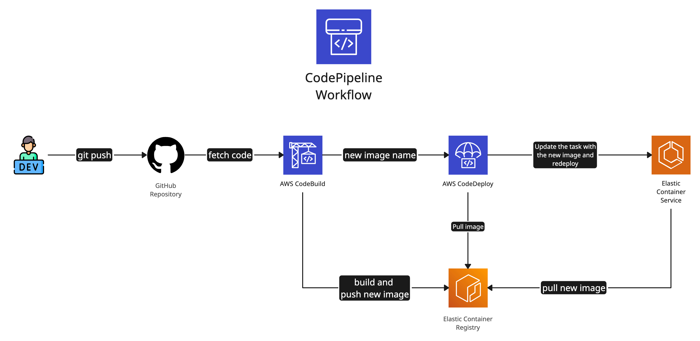

# AWS DevOps and CI/CD

This guide explores AWS services and best practices for implementing DevOps methodologies and CI/CD pipelines in the cloud.

## Table of Contents
1. [Introduction to DevOps on AWS](#introduction-to-devops-on-aws)
2. [Key AWS Services for DevOps](#key-aws-services-for-devops)
3. [Building a CI/CD Pipeline on AWS](#building-a-cicd-pipeline-on-aws)
4. [Infrastructure as Code (IaC) with AWS](#infrastructure-as-code-iac-with-aws)
5. [Monitoring and Logging](#monitoring-and-logging)
6. [Best Practices](#best-practices)
7. [Case Studies](#case-studies)
8. [Additional Resources](#additional-resources)

## Key AWS Services for DevOps

1. **AWS CodePipeline**: Continuous delivery service for fast and reliable application updates.

2. **AWS CodeBuild**: Fully managed build service that compiles source code, runs tests, and produces software packages.

3. **AWS CodeDeploy**: Automated deployment service to deploy to EC2 instances, on-premises systems, serverless Lambda functions, or ECS services.

4. **AWS CodeArtifact**: Fully managed artifact repository service that makes it easy for organizations to securely store, publish, and share software packages.

5. **AWS CodeGuru**: Developer tool powered by machine learning that provides intelligent recommendations for improving code quality and identifying an application's most expensive lines of code.

6. **AWS CodeWhisperer**: AI-powered coding companion that generates code suggestions in real-time, trained on billions of lines of code.

## Source Control and Development Environments

While AWS no longer offers CodeCommit for source control or Cloud9 as a cloud IDE, there are excellent alternatives that integrate well with AWS services:

1. **Source Control**:
   - GitHub: Widely used Git repository hosting service, now owned by Microsoft but with excellent AWS integration.
   - GitLab: Provides source code management, CI/CD, and more, with AWS integration capabilities.
   - Bitbucket: Atlassian's Git solution, also offers good AWS integration.

2. **Cloud Development Environments**:
   - GitHub Codespaces: Cloud-based development environment that can be configured to work with AWS.
   - GitPod: Open-source developer platform that can be used with AWS projects.
   - AWS CloudShell: While not a full IDE, it provides a browser-based shell for managing AWS resources.

## Building a CI/CD Pipeline on AWS

A typical CI/CD pipeline on AWS might now look like this:

1. Developers push code to a GitHub or GitLab repository.
2. CodePipeline detects the change and triggers the pipeline.
3. CodeBuild compiles the code, runs tests, and creates build artifacts.
4. CodeDeploy takes the artifacts and deploys them to the target environment (e.g., EC2, ECS, or Lambda).
5. AWS CloudWatch monitors the application and infrastructure.

Here's a visual representation of a pipeline with ECR and ECS:



In this diagram, you can see how each AWS service plays a role in the CI/CD process:
- Source control (GitHub/GitLab) stores the application code.
- CodePipeline orchestrates the entire workflow.
- CodeBuild handles the build and test phases.
- CodeDeploy manages the deployment to various AWS services.

## Infrastructure as Code (IaC) with AWS

AWS supports multiple IaC tools:

1. **AWS CloudFormation**: AWS's native IaC service.
2. **AWS CDK (Cloud Development Kit)**: Define cloud infrastructure using familiar programming languages.
3. **Terraform**: Popular third-party IaC tool with strong AWS support.

Example CloudFormation template snippet:
```yaml
AWSTemplateFormatVersion: "2010-09-09"
Description: "CloudFormation Template to create an EC2 instance"
Resources:
  MyEC2Instance:
    Type: AWS::EC2::Instance
    Properties:
      InstanceType: t2.micro
      ImageId: ami-xxxxxxxxxxx
```

## Monitoring and Logging

Effective DevOps requires robust monitoring and logging:

1. **Amazon CloudWatch**: Monitoring and observability service.
2. **AWS X-Ray**: Analyze and debug production, distributed applications.
3. **Amazon EventBridge**: Serverless event bus for building event-driven applications.

## Best Practices

1. Automate everything: From code commits to production deployment.
2. Use Infrastructure as Code: Treat infrastructure like application code.
3. Implement proper monitoring and logging: For quick issue detection and resolution.
4. Practice continuous testing: Integrate automated testing at every stage.
5. Embrace microservices: For more flexible, scalable architectures.
6. Implement security at every layer: Use AWS Identity and Access Management (IAM) and follow the principle of least privilege.

## Case Studies

1. Capital One: Reduced development cycles from weeks to days using AWS DevOps practices.
   [Capital One Case Study](https://aws.amazon.com/solutions/case-studies/capital-one-devops/)

2. Coca-Cola: Improved release frequency and quality using AWS CI/CD tools.
   [Coca-Cola Case Study](https://aws.amazon.com/solutions/case-studies/coca-cola-case-study/)

## Additional Resources

1. [AWS DevOps Blog](https://aws.amazon.com/blogs/devops/)
2. [AWS DevOps Certification](https://aws.amazon.com/certification/certified-devops-engineer-professional/)
3. [AWS DevOps Partner Solutions](https://aws.amazon.com/devops/partner-solutions/)

Remember, successful DevOps implementation is as much about culture and processes as it is about tools. AWS provides the tools, but organizations need to foster a culture of collaboration, experimentation, and continuous improvement to truly reap the benefits of DevOps.