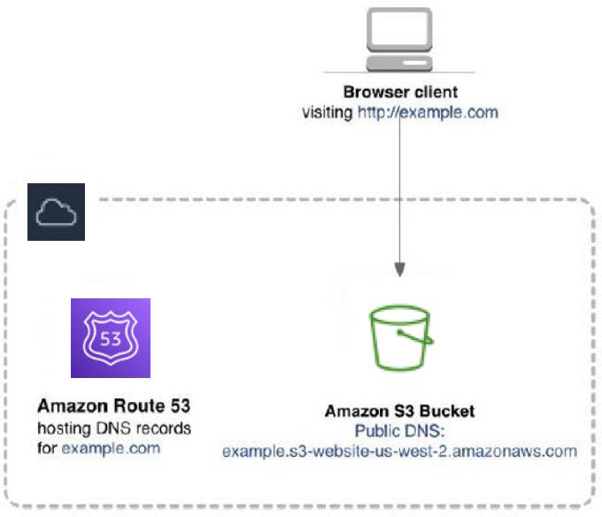

# Create an S3 Static Website

## Description
This project demonstrates how to set up a static website using Amazon S3 (Simple Storage Service). We will cover both the AWS Management Console (GUI) and AWS CLI methods to create and configure an S3 bucket for static website hosting.

## Architecture Diagram 



## Prerequisites

- AWS account with appropriate permissions
- Basic understanding of HTML and web technologies
- A simple website (HTML, CSS, and JavaScript files) ready to be hosted
- For CLI method: AWS CLI installed and configured
  - [Installing the AWS CLI](https://docs.aws.amazon.com/cli/latest/userguide/cli-chap-install.html)
  - [Configuring the AWS CLI](https://docs.aws.amazon.com/cli/latest/userguide/cli-chap-configure.html)

## Method 1: Using AWS Management Console (GUI)

1. Create an S3 Bucket
   - Navigate to S3 in the AWS Management Console
   - Click "Create bucket" and choose a unique name
   - Uncheck "Block all public access"

2. Enable Static Website Hosting
   - In bucket "Properties", edit "Static website hosting"
   - Enable hosting and set index document to "index.html"

3. Set Bucket Policy
   - In "Permissions", edit the bucket policy
   - Use the policy below, replacing `your-bucket-name`:

   ```json
   {
       "Version": "2012-10-17",
       "Statement": [
           {
               "Sid": "PublicReadGetObject",
               "Effect": "Allow",
               "Principal": "*",
               "Action": "s3:GetObject",
               "Resource": "arn:aws:s3:::your-bucket-name/*"
           }
       ]
   }
   ```

4. Upload Website Files
   - Go to the "Objects" tab and upload your website files

## Method 2: Using AWS CLI

1. Create an S3 Bucket
   ```bash
   aws s3api create-bucket --bucket your-bucket-name --region your-region --create-bucket-configuration LocationConstraint=your-region
   ```

2. Enable Static Website Hosting
   ```bash
   aws s3 website s3://your-bucket-name/ --index-document index.html --error-document error.html
   ```

3. Set Bucket Policy
   Create `bucket-policy.json`:
   ```json
   {
       "Version": "2012-10-17",
       "Statement": [
           {
               "Sid": "PublicReadGetObject",
               "Effect": "Allow",
               "Principal": "*",
               "Action": "s3:GetObject",
               "Resource": "arn:aws:s3:::your-bucket-name/*"
           }
       ]
   }
   ```
   Apply the policy:
   ```bash
   aws s3api put-bucket-policy --bucket your-bucket-name --policy file://bucket-policy.json
   ```

4. Upload Website Files
   ```bash
   aws s3 sync ./your-website-folder s3://your-bucket-name
   ```

## Accessing Your Website

Access your website at:
```
http://your-bucket-name.s3-website-your-region.amazonaws.com
```

## Cleanup

1. Empty the S3 bucket:
   ```bash
   aws s3 rm s3://your-bucket-name --recursive
   ```

2. Delete the S3 bucket:
   ```bash
   aws s3api delete-bucket --bucket your-bucket-name
   ```

## Additional Resources

- [Amazon S3 Static Website Hosting Documentation](https://docs.aws.amazon.com/AmazonS3/latest/userguide/WebsiteHosting.html)
- [S3 Bucket Policies](https://docs.aws.amazon.com/AmazonS3/latest/userguide/example-bucket-policies.html)
- [AWS CLI S3 Commands](https://docs.aws.amazon.com/cli/latest/reference/s3/)