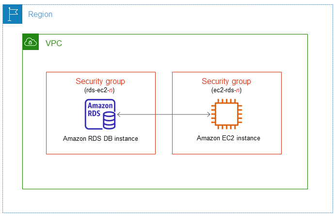

# Set up an Amazon RDS Instance

## Description
This project demonstrates how to set up an Amazon Relational Database Service (RDS) instance using the AWS Management Console (GUI), AWS CLI, and Terraform methods.

**Important Security Note:** While this guide focuses on basic setup, in a production environment, you should implement additional security measures such as using security groups, setting up in a private subnet, and configuring appropriate inbound/outbound rules. Proper security configuration is crucial for protecting your RDS instance.

## Architecture Diagram



## Prerequisites

- AWS account with appropriate permissions
- Basic understanding of relational databases
- For CLI method: AWS CLI installed and configured
  - [Installing the AWS CLI](https://docs.aws.amazon.com/cli/latest/userguide/cli-chap-install.html)
  - [Configuring the AWS CLI](https://docs.aws.amazon.com/cli/latest/userguide/cli-chap-configure.html)
- For Terraform method: Terraform installed
  - [Installing Terraform](https://learn.hashicorp.com/tutorials/terraform/install-cli)

## Method 1: Using AWS Management Console (GUI)

1. Create an RDS Instance
   - Navigate to RDS in the AWS Management Console
   - Click "Create database"
   - Choose engine type (e.g., MySQL, PostgreSQL)
   - Select version and instance specifications
   - Configure storage and network settings
   - Set up database credentials
   - Review and create

2. Connect to Your RDS Instance
   - Use the endpoint provided in the RDS console
   - Connect using your preferred database client

## Method 2: Using AWS CLI

1. Create RDS Instance
   ```bash
   aws rds create-db-instance \
     --db-instance-identifier mydbinstance \
     --db-instance-class db.t3.micro \
     --engine mysql \
     --master-username admin \
     --master-user-password your_password \
     --allocated-storage 20
   ```

2. Describe RDS Instance to Get Endpoint
   ```bash
   aws rds describe-db-instances --db-instance-identifier mydbinstance
   ```

## Method 3: Using Terraform

1. Create a Terraform Configuration File (e.g., `main.tf`)
   ```hcl
   provider "aws" {
     region = "us-east-1"  # Change to your preferred region
   }

   resource "aws_db_instance" "default" {
     identifier        = "mydbinstance" 
     engine            = "mysql"
     engine_version    = "5.7"
     instance_class    = "db.t3.micro"
     allocated_storage = 20
     username          = "admin"
     password          = "your_password"  # Use variables in production
     skip_final_snapshot = true
   }

   output "db_endpoint" {
     value = aws_db_instance.default.endpoint
   }
   ```

2. Initialize Terraform 
   ```bash
   terraform init
   ```

3. Apply the Configuration
   ```bash
   terraform apply
   ```

4. Get the RDS Endpoint
   The endpoint will be displayed in the Terraform output.

## Accessing Your RDS Instance

Use the endpoint provided in the RDS console, CLI output, or Terraform output to connect to your database using your preferred client.

## Cleanup

1. For Console/CLI: Delete the RDS instance:
   ```bash
   aws rds delete-db-instance --db-instance-identifier mydbinstance --skip-final-snapshot
   ```

2. For Terraform: Destroy the resources:
   ```bash
   terraform destroy
   ```

## Additional Resources

- [Amazon RDS Documentation](https://docs.aws.amazon.com/AmazonRDS/latest/UserGuide/Welcome.html)
- [RDS CLI Commands Reference](https://docs.aws.amazon.com/cli/latest/reference/rds/index.html)
- [Best Practices for Amazon RDS](https://docs.aws.amazon.com/AmazonRDS/latest/UserGuide/CHAP_BestPractices.html)
- [Security in Amazon RDS](https://docs.aws.amazon.com/AmazonRDS/latest/UserGuide/UsingWithRDS.html)
- [Terraform AWS Provider Documentation](https://registry.terraform.io/providers/hashicorp/aws/latest/docs)