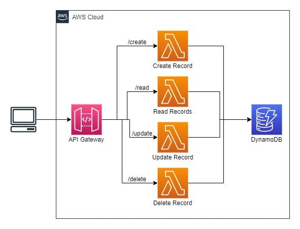

# Serverless DynamoDB CRUD Operations

## Description
This project demonstrates how to create a serverless application that performs CRUD (Create, Read, Update, Delete) operations on a DynamoDB table using AWS Lambda and API Gateway. The implementation follows the principle of least privilege with specific policies for each Lambda function.

## Architecture Diagram



## Understanding the Services Used

### Amazon DynamoDB
- A fully managed NoSQL database service that provides fast and predictable performance with seamless scalability
- Key features:
  - Serverless: No servers to manage
  - Automatic scaling: Handles traffic increases without intervention
  - Performance: Single-digit millisecond response times
  - Fully managed: AWS handles all the infrastructure work
- Why we use it in this project:
  - Perfect for serverless applications
  - Simple key-value data model suits our notes application
  - Automatic scaling matches our serverless architecture
  - Pay-per-request pricing aligns with our usage patterns

### AWS Lambda
- A serverless compute service that runs your code in response to events
- Key features:
  - Serverless: No server management needed
  - Event-driven: Runs code in response to events
  - Automatic scaling: Handles concurrent executions automatically
  - Pay-per-use: Only pay for the compute time you consume
- Why we use it in this project:
  - Handles API requests efficiently
  - Scales automatically with user demand
  - Cost-effective for variable workloads
  - Integrates well with API Gateway and DynamoDB

### Amazon API Gateway
- A fully managed service for creating, publishing, and managing APIs
- Key features:
  - API management
  - Traffic management
  - Security features
  - Monitoring and metrics
- Why we use it in this project:
  - Creates RESTful API endpoints
  - Handles request/response transformations
  - Provides security features
  - Offers usage plans and API keys if needed

## Important Concepts

### Lambda Proxy Integration
Lambda proxy integration is a simplified, powerful integration type in API Gateway that passes all request information to your Lambda function.

#### Why We Use It:
1. Simplifies API Gateway configuration
2. Provides access to all request information in Lambda:
   - Headers
   - Query string parameters
   - URL path parameters
   - Body
   - API Gateway context
   - Stage variables
3. Allows Lambda to control the complete response:
   - Status code
   - Headers
   - Body

#### When to Use Lambda Proxy vs. Non-Proxy:
- Use Lambda Proxy when:
  - You want complete control over the request/response in your Lambda code
  - You need access to request context information
  - You want to minimize API Gateway configuration
  
- Use Non-Proxy when:
  - You need API Gateway to handle request/response transformations
  - You want to use API Gateway mapping templates
  - You need to modify requests before they reach Lambda

### CORS (Cross-Origin Resource Sharing)
CORS is a security feature implemented by web browsers that controls how web pages in one domain can request and interact with resources in another domain.

#### When to Enable CORS:
Enable CORS when:
1. Your API is called from a web browser
2. The website calling your API is hosted on a different domain than your API
3. You're building a web application that makes JavaScript/AJAX calls to your API

#### Our CORS Configuration Explained:
In this project, we enable CORS because:
- The API might be called from web applications
- It allows testing from different domains
- It enables integration with front-end applications

To enable CORS in API Gateway:
1. The 'Access-Control-Allow-Origin' header in Lambda responses
2. OPTIONS method configuration in API Gateway
3. Proper handling of CORS headers

#### CORS Headers Used:
```json
{
    "Access-Control-Allow-Origin": "*",
    "Access-Control-Allow-Headers": "Content-Type",
    "Access-Control-Allow-Methods": "OPTIONS,POST,GET,PUT,DELETE"
}
```

## Prerequisites

- AWS account with appropriate permissions
- AWS CLI installed and configured
  - [Installing the AWS CLI](https://docs.aws.amazon.com/cli/latest/userguide/cli-chap-install.html)
  - [Configuring the AWS CLI](https://docs.aws.amazon.com/cli/latest/userguide/cli-chap-configure.html)
- Basic understanding of JSON and REST APIs

## Implementation Steps

### Step 1: Create DynamoDB Table

1. Navigate to DynamoDB in AWS Console
2. Click "Create table"
3. Enter the following details:
   - Table name: `notes`
   - Partition key: `id` (String)
4. Leave all other settings as default
5. Click "Create table"

### Step 2: Create IAM Policies

Create four separate policies for each DynamoDB operation:

1. createNotePolicy:
```json
{
    "Version": "2012-10-17",
    "Statement": [
        {
            "Effect": "Allow",
            "Action": [
                "dynamodb:PutItem"
            ],
            "Resource": "arn:aws:dynamodb:*:*:table/notes"
        }
    ]
}
```

2. readNotePolicy:
```json
{
    "Version": "2012-10-17",
    "Statement": [
        {
            "Effect": "Allow",
            "Action": [
                "dynamodb:GetItem"
            ],
            "Resource": "arn:aws:dynamodb:*:*:table/notes"
        }
    ]
}
```

3. updateNotePolicy:
```json
{
    "Version": "2012-10-17",
    "Statement": [
        {
            "Effect": "Allow",
            "Action": [
                "dynamodb:UpdateItem"
            ],
            "Resource": "arn:aws:dynamodb:*:*:table/notes"
        }
    ]
}
```

4. deleteNotePolicy:
```json
{
    "Version": "2012-10-17",
    "Statement": [
        {
            "Effect": "Allow",
            "Action": [
                "dynamodb:DeleteItem"
            ],
            "Resource": "arn:aws:dynamodb:*:*:table/notes"
        }
    ]
}
```

### Step 3: Create Lambda Functions

Create four Lambda functions, each with basic execution role first:

#### createNote Function
```python
# Required imports
import json              # For JSON parsing and serialization
import boto3            # AWS SDK for Python
import uuid             # For generating unique IDs

# Initialize DynamoDB resource and table reference
dynamodb = boto3.resource('dynamodb')
table = dynamodb.Table('notes')    # Reference to our 'notes' table

def lambda_handler(event, context):
    """
    Creates a new note in DynamoDB table.
    
    Parameters:
        event (dict): API Gateway event information
        context (LambdaContext): Lambda runtime information
        
    Returns:
        dict: API Gateway response object
    """
    try:
        # Parse the JSON string from the request body
        body = json.loads(event['body'])
        
        # Create new item with UUID and request data
        item = {
            'id': str(uuid.uuid4()),    # Generate unique ID
            'title': body['title'],     # Extract title from request
            'content': body['content']  # Extract content from request
        }
        
        # Insert the item into DynamoDB
        table.put_item(Item=item)
        
        # Return success response
        return {
            'statusCode': 201,          # HTTP 201 Created
            'headers': {
                'Content-Type': 'application/json'
            },
            'body': json.dumps({
                'message': 'Note created successfully',
                'id': item['id']        # Return the generated ID
            })
        }
        
    except Exception as e:
        # Handle any errors and return 500 response
        return {
            'statusCode': 500,          # HTTP 500 Internal Server Error
            'headers': {
                'Content-Type': 'application/json'
            },
            'body': json.dumps({
                'error': str(e)
            })
        }
```

#### readNote Function
```python
import json
import boto3

dynamodb = boto3.resource('dynamodb')
table = dynamodb.Table('notes')

def lambda_handler(event, context):
    try:
        note_id = event['pathParameters']['id']
        response = table.get_item(Key={'id': note_id})
        
        if 'Item' in response:
            return {
                'statusCode': 200,
                'headers': {
                    'Content-Type': 'application/json'
                },
                'body': json.dumps(response['Item'])
            }
        else:
            return {
                'statusCode': 404,
                'headers': {
                    'Content-Type': 'application/json'
                },
                'body': json.dumps({
                    'message': 'Note not found'
                })
            }
    except Exception as e:
        return {
            'statusCode': 500, 
            'headers': {
                'Content-Type': 'application/json'
            },
            'body': json.dumps({
                'error': str(e)
            })
        }
```

#### updateNote Function
```python
import json
import boto3

dynamodb = boto3.resource('dynamodb')
table = dynamodb.Table('notes')

def lambda_handler(event, context):
    try:
        note_id = event['pathParameters']['id']
        body = json.loads(event['body'])
        
        response = table.update_item(
            Key={'id': note_id},
            UpdateExpression='SET title = :title, content = :content',
            ExpressionAttributeValues={
                ':title': body['title'],
                ':content': body['content']
            },
            ReturnValues='ALL_NEW'
        )
        
        return {
            'statusCode': 200,
            'headers': {
                'Content-Type': 'application/json'
            },
            'body': json.dumps(response['Attributes'])
        }
    except Exception as e:
        return {
            'statusCode': 500,
            'headers': {
                'Content-Type': 'application/json'
            },
            'body': json.dumps({
                'error': str(e)
            })
        }
```

#### deleteNote Function
```python
import json
import boto3

dynamodb = boto3.resource('dynamodb')
table = dynamodb.Table('notes')

def lambda_handler(event, context):
    try:
        note_id = event['pathParameters']['id']
        table.delete_item(Key={'id': note_id})
        
        return {
            'statusCode': 200,
            'headers': {
                'Content-Type': 'application/json'
            },
            'body': json.dumps({
                'message': 'Note deleted successfully'
            })
        }
    except Exception as e:
        return {
            'statusCode': 500,
            'headers': {
                'Content-Type': 'application/json'
            },
            'body': json.dumps({
                'error': str(e)
            })
        }
```

### Step 4: Attach Policies to Lambda Functions

After creating each Lambda function with the basic execution role, attach the corresponding DynamoDB policy:
1. Go to each Lambda function's configuration
2. Under "Permissions", click on the execution role
3. Click "Attach policies"
4. Search for and attach the corresponding policy created in Step 2

### Step 5: Create API Gateway

1. Go to API Gateway Console
2. Create new REST API
3. Create resources and methods:

   POST /notes -> createNote Lambda
   GET /notes/{id} -> readNote Lambda
   PUT /notes/{id} -> updateNote Lambda
   DELETE /notes/{id} -> deleteNote Lambda

4. Deploy the API to a 'prod' stage

## Testing

### Lambda Function Tests

1. createNote Lambda test:
```json
{
  "body": "{\"title\": \"Test Note\", \"content\": \"This is a test note\"}"
}
```

2. readNote Lambda test:
```json
{
  "pathParameters": {
    "id": "YOUR-NOTE-ID"
  }
}
```

3. updateNote Lambda test:
```json
{
  "pathParameters": {
    "id": "YOUR-NOTE-ID"
  },
  "body": "{\"title\": \"Updated Test Note\", \"content\": \"This note has been updated\"}"
}
```

4. deleteNote Lambda test:
```json
{
  "pathParameters": {
    "id": "YOUR-NOTE-ID"
  }
}
```

### API Testing with curl

1. Create Note:
```bash
curl -X POST \
  https://YOUR-API-ID.execute-api.us-east-1.amazonaws.com/prod/notes \
  -H 'Content-Type: application/json' \
  -d '{"title": "Test Note", "content": "This is a test note using curl"}'
```

2. Read Note:
```bash
curl -X GET \
  https://YOUR-API-ID.execute-api.us-east-1.amazonaws.com/prod/notes/YOUR-NOTE-ID
```

3. Update Note:
```bash
curl -X PUT \
  https://YOUR-API-ID.execute-api.us-east-1.amazonaws.com/prod/notes/YOUR-NOTE-ID \
  -H 'Content-Type: application/json' \
  -d '{"title": "Updated Note", "content": "This note has been updated via API"}'
```

4. Delete Note:
```bash
curl -X DELETE \
  https://YOUR-API-ID.execute-api.us-east-1.amazonaws.com/prod/notes/YOUR-NOTE-ID
```

## Cleanup

1. Delete the API Gateway API
2. Delete all Lambda functions
3. Delete the DynamoDB table
4. Delete the IAM policies
5. Delete the Lambda execution roles

## Additional Resources

- [AWS Lambda Developer Guide](https://docs.aws.amazon.com/lambda/latest/dg/welcome.html)
- [Amazon DynamoDB Developer Guide](https://docs.aws.amazon.com/amazondynamodb/latest/developerguide/Introduction.html)
- [Amazon API Gateway Developer Guide](https://docs.aws.amazon.com/apigateway/latest/developerguide/welcome.html)