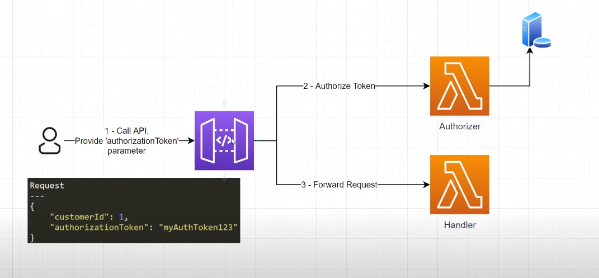
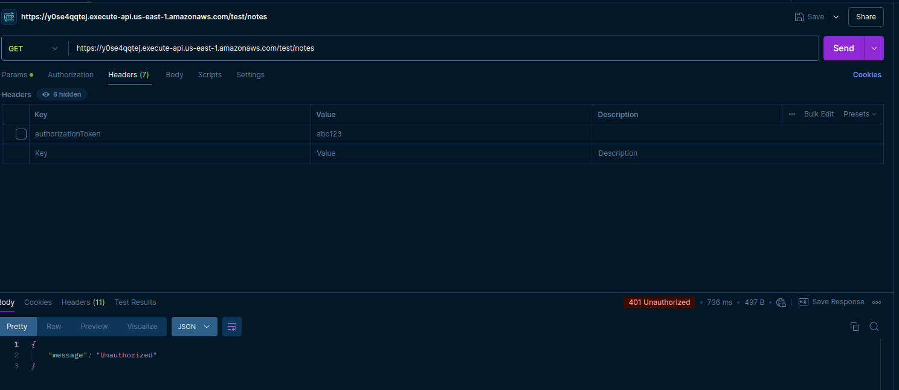
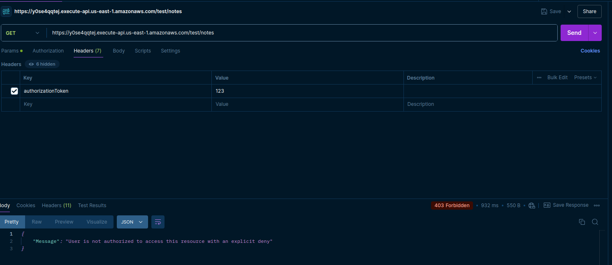
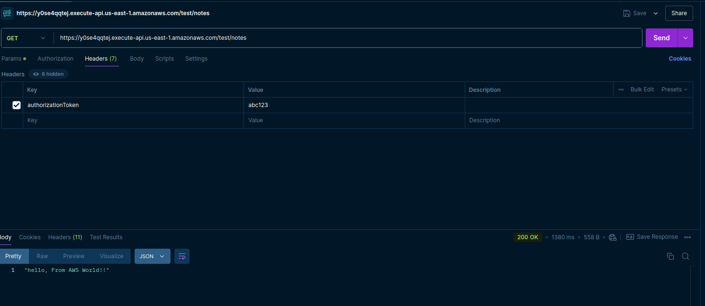

# API Gateway with Lambda Authorizer

## Description
This repository provides a guide to setting up an AWS API Gateway with a Lambda authorizer for secure access control. The Lambda authorizer will authenticate incoming requests to ensure only authorized clients can access the API.

## Architecture Diagram 




## Overview
AWS API Gateway with Lambda Authorizer allows for custom authorization logic to control access to APIs. The Lambda function performs authorization, returning either an `Allow` or `Deny` policy.

## Architecture
The architecture consists of:
- **API Gateway**: Routes incoming requests to the Lambda authorizer.
- **Lambda Authorizer**: Validates requests based on headers (e.g., tokens) and returns authorization policies.
- **Backend Lambda Function**: Receives requests if authorized.

## Prerequisites
- **AWS Account** with permissions to create API Gateway, Lambda functions, and IAM roles.
- **Node.js** or **Python** (for Lambda authorizer code).
- AWS CLI installed and configured
  - [Installing the AWS CLI](https://docs.aws.amazon.com/cli/latest/userguide/cli-chap-install.html)
  - [Configuring the AWS CLI](https://docs.aws.amazon.com/cli/latest/userguide/cli-chap-configure.html)
- Basic understanding of JSON and REST APIs
- A Basic Lambda Function (REST) for testing


## Setup Instructions

### 1. Create a Lambda  for Testing 

1. Open the AWS Lambda Console
- Go to the AWS Lambda Console.
- Sign in if prompted.

2. Create a New Lambda Function
- Click on Create Function.
- Choose Author from scratch.
- Enter the function name as DemoHandler.
- Select the Runtime as Python 3.x (choose any version 3.x).
- Click Create function at the bottom of the page.
  
3. Add the Code
- In the Function code section, delete any existing code in the editor.

Copy and paste the following code:

```
def lambda_handler(event, context):
    print(event)
    return "hello, From AWS World!!"
```

- Click Deploy in the top-right corner to save and deploy your changes.
  
4. Create a Test Event
   
- In the Lambda console, click on the Test button.
- Choose Create new test event.
- Enter an Event name (e.g., TestEvent).

- Use the default JSON template, or modify it as needed, such as:

```json
{
  "key1": "value1",
  "key2": "value2",
  "key3": "value3"
}
```
- Click Create.
  
5. Run the test 

- With the TestEvent selected, click Test. 
- The Lambda function will execute, and you should see the result in the Execution results section.

## Expected Output

- Logs: In the Logs section, you should see the printed event data as specified in the function.

Return Value: The output should be:

```
"hello, From AWS World!!"
```


### 2. Set Up API Gateway

**Creating API Gateway for Demo Lambda**

Step 1: Open the API Gateway Console
1. Go to the [API Gateway Console](https://console.aws.amazon.com/apigateway).
2. Select **Create API**.

Step 2: Create a REST API
1. Choose **REST API**.
2. Select **Build**.
3. Enter a name for the API, such as `DemoAPI`.
4. Select **Regional** as the endpoint type.
5. Click **Create API**.

Step 3: Create a Resource
1. In the **Resources** section, click **Actions** and choose **Create Resource**.
2. Enter `notes` as the **Resource Name** (this will create a `/notes` endpoint).
3. Select **Create Resource**.

Step 4: Create a GET Method
1. With the `/notes` resource selected, click **Actions** and choose **Create Method**.
2. Select **GET** from the dropdown.
3. Choose **Lambda Function** as the integration type.
4. Check **Use Lambda Proxy integration**.
5. Select the region where your Lambda is deployed.
6. Enter `DemoHandler` as the Lambda function name.
7. Click **Save** and then **OK** to allow API Gateway to invoke your Lambda function.

Step 5: Deploy the API
1. Click **Actions** and select **Deploy API**.
2. Choose **[New Stage]** from the dropdown, and enter `Test` as the **Stage name**.
3. Click **Deploy**.

Step 6: Test the API
1. In the **Stages** section, select the **Test** stage.
2. Copy the **Invoke URL** displayed at the top.

Testing the Endpoint
- Open a browser or use `curl` to make a GET request to the `/notes` endpoint:

   ```bash
   curl -X GET <Invoke URL>/notes
   ```

## Creating Authorizer Function 

1. Open the AWS Lambda Console
- Go to the AWS Lambda Console.
- Sign in if prompted.

2. Create a New Lambda Function
- Click on Create Function.
- Choose Author from scratch.
- Enter the function name as DemoHandler.
- Select the Runtime as Python 3.x (choose any version 3.x).
- Click Create function at the bottom of the page.
  
3. Add the Code
- In the Function code section, delete any existing code in the editor.

Copy and paste the following code:

```
DemoAuthorizer
---
def lambda_handler(event, context):
    
    #1 - Log the event
    print('*********** The event is: ***************')
    print(event)
    
    #2 - See if the person's token is valid
    auth = 'Deny'
    if event['authorizationToken'] == 'AWS456':
        auth = 'Allow'
    else:
        auth = 'Deny'
    
    #3 - Construct and return the response
    authResponse = { "principalId": "abc123", "policyDocument": { "Version": "2012-10-17", "Statement": [{"Action": "execute-api:Invoke", "Resource": ["arn:aws:execute-api:us-east-1:YOURACCOUNTNUMBER:apiuid/*/*"], "Effect": auth}] }}
    return authResponse
```

- Click Deploy in the top-right corner to save and deploy your changes.
  
## Adding Authorizer to API Gateway

1. Navigate to the [API Gateway Console](https://console.aws.amazon.com/apigateway).
2. Create a new **REST API** or select an existing API.
3. Go to the **Authorizers** section and click **Create New Authorizer**:
   - Name: `MyAuthorizer`
   - Type: `Lambda`
   - Lambda Function: Select `DemoAuthorizer`
   - Token Source: Specify header name (e.g., `Authorization`)
4. Set up **Resources and Methods**:
   - Add resources and methods (e.g., `GET /notes`).
   - For **Method Request**, set **Authorization** to `MyAuthorizer`.
5. Deploy the API to a new or existing **Stage**.

### 3. Test the API
1. Copy the **Invoke URL** from your API Gateway stage.
2. Use a tool like **Postman** or **curl** to test:
   ```bash
   curl -X GET '<Invoke_URL>/myresource' -H 'Authorization: <YourAuthToken>'

### 4. Test it with POSTMAN

1. Add the API URL and select the method as `GET` and then hit the api 

you will see an example output like this 



2. Now to check if the authorization policy of `DENY` is working then we need to add authorization token that we set in the lambda function in the headers section, but lets put the wrong token to check the Deny Policy

you will see an example output like this



3. Now we will check that our authorization is working or not and are we able to see the expected output , now we will add correct Token to get a proper response 

you will see an example output like this




### Conclusion

So we have created An Lambda Authorizer to secure the API