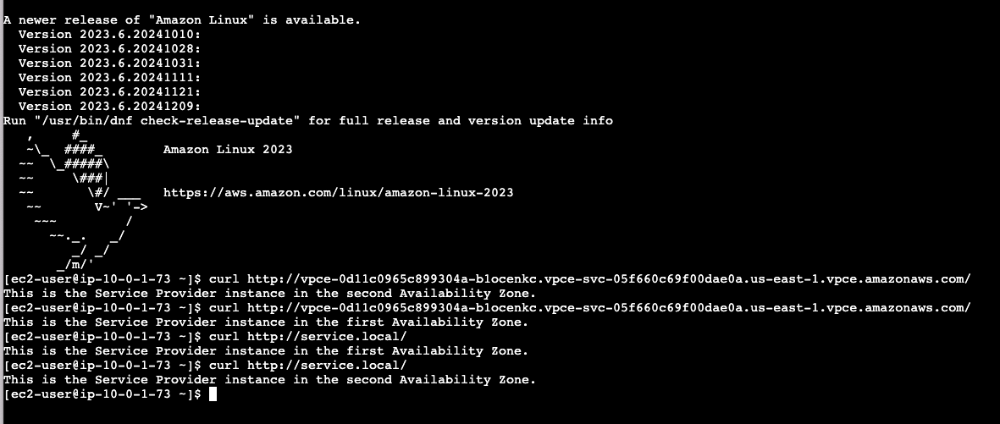

# How to implement a Service Provider and Consumer with AWS PrivateLink

AWS PrivateLink is a service that enables you to securely access services hosted on AWS in a highly available and scalable manner, without using public IPs, and without requiring the traffic to traverse the internet. It allows you to privately connect your VPC to supported AWS services, your own services, or third-party services using private IP addresses as if they were in your VPC.

In this project we will create a Service Provider and Consumer with AWS PrivateLink connection between two VPCs in the same account. You can use the same technique to connect VPCs from different accounts.

- **Service Provider VPC**: The service will be hosted by EC2 instances in private subnets and exposed by an endpoint service associated with a Network Load Balancer (NLB).
- **Service Consumer VPC**: EC2 instances in public subnets will connect to the service using an interface VPC endpoint exposed with a Route 53 private hosted zone.

Here is the architecture diagram of the solution:


### Prerequisites to deploy this solution
- AWS account with appropriate permissions.
- Basic understanding of AWS services
- AWS CLI installed and configured. All the command lines will be run from the current directory.

## 1. Service Provider Infrastructure

We will use the [service-provider](cloudformation/service-provider.yaml) template to create the Service Provider Infrastructure. This  will deploy an Endpoint Service with a Network Load Balancer (NLB) and two EC2 instances in private subnets across two Availability Zones. The NLB will distribute traffic to the EC2 instances, which will serve a simple web page. The template also creates a VPC, subnets, Internet Gateway, NAT Gateways, Security Groups and route tables.

### 1.1 Parameters

The template accepts the following parameters:

| Parameter             | Description                                                        | Type   | Default           |
|-----------------------|--------------------------------------------------------------------|--------|-------------------|
| `ProjectName`         | The project name that is prefixed to resource names                | String | `ServiceProvider` |
| `VpcCIDR`             | IP range (CIDR notation) for this VPC             | String | `10.0.0.0/16`     |
| `PublicSubnet1CIDR`   | IP range (CIDR notation) for the public subnet in the first Availability Zone | String | `10.0.1.0/24`     |
| `PrivateSubnet1CIDR`  | IP range (CIDR notation) for the private subnet in the first Availability Zone | String | `10.0.2.0/24`     |
| `PublicSubnet2CIDR`   | IP range (CIDR notation) for the public subnet in the second Availability Zone | String | `10.0.3.0/24`     |
| `PrivateSubnet2CIDR`  | IP range (CIDR notation) for the private subnet in the second Availability Zone | String | `10.0.4.0/24`     |
| `InstanceType`        | EC2 instance type                                                  | String | `t2.micro`        |

### 1.2 Resources

The template creates the following resources:

- **Service Provider VPC**: A Virtual Private Cloud with the specified CIDR block.
- **Subnets**: Public and private subnets in two Availability Zones.
- **Internet Gateway**: An Internet Gateway for internet access to the VPC.
- **NAT Gateways**: NAT Gateways in the public subnets to provide outgoing internet access to the EC2 instances in the private subnets.
- **Route Tables**: Route tables for the public and private subnets.
- **EC2 Instances**: Two EC2 instances in the private subnets serving a simple web page.
- **Network Load Balancer**: An internal NLB to distribute traffic to the EC2 instances.
- **NLB Security Group**: Firewall to specify which traffic is allowed to reach the Network Load Balancer. We only allow traffic on port 80 from the VPC CIDR block.
- **EC2 Security Group**: Firewall to specify which traffic is allowed to reach the EC2 instances. We only allow traffic on port 80 from the NLB Security Group.
- **VPC Endpoint Service**: A VPC endpoint service for the NLB. This will be the entry point for the service provider. It requires acceptance before connecting to the service.

### 1.3 Outputs

The template provides the following output:

- **Endpoint Service Id**: The ID of the VPC Endpoint Service.

### 1.4 Deployment

You can deploy the CloudFormation stack by using the AWS Management Console or running the following AWS CLI command. You can adjust the parameters with your preference.

```bash
aws cloudformation create-stack --stack-name ServiceProvider --template-body file://cloudformation/service-provider.yaml --parameters ParameterKey=ProjectName,ParameterValue=ServiceProvider ParameterKey=VpcCIDR,ParameterValue=10.0.0.0/16 ParameterKey=PublicSubnet1CIDR,ParameterValue=10.0.1.0/24 ParameterKey=PrivateSubnet1CIDR,ParameterValue=10.0.2.0/24 ParameterKey=PublicSubnet2CIDR,ParameterValue=10.0.3.0/24 ParameterKey=PrivateSubnet2CIDR,ParameterValue=10.0.4.0/24 ParameterKey=InstanceType,ParameterValue=t2.micro
```

## 2. Service Consumer Infrastructure

We will use the [service-consumer](cloudformation/service-consumer.yaml) template to deploy the infrastructure for the Service Consumer VPC that connects to the Service Provider VPC using AWS PrivateLink. The Service Consumer VPC contains EC2 instances in public subnets that access a service exposed by the Service Provider VPC through an interface VPC endpoint. The template also deploys a private hosted zone in Route 53 to create a user-friendly domain name for the interface endpoint.

### 2.1 Parameters

The following parameters can be customized at the time of deployment:

| Parameter             | Description                                                        | Type   | Default           |
|-----------------------|--------------------------------------------------------------------|--------|-------------------|
| `ProjectName`         | The project name that is prefixed to resource names                | String | `ServiceConsumer` |
| `VpcCIDR`             | IP range (CIDR notation) for this VPC             | String | `10.1.0.0/16`     |
| `PublicSubnet1CIDR`   | IP range (CIDR notation) for the public subnet in the first Availability Zone | String | `10.1.1.0/24`     |
| `PublicSubnet2CIDR`   | IP range (CIDR notation) for the public subnet in the second Availability Zone | String | `10.1.3.0/24`     |
| `InstanceType`        | EC2 instance type                                                  | String | `t2.micro`        |
| `EndpointServiceId`   | The ID of the endpoint service provider. You can retrieve it from the AWS Management Console or the output of the Service Provider CloudFormation stack             | String |    |
| `PrivateDomainName`   | The private domain name for the Route 53 hosted zone               | String | `service.local`   |

### 2.2 Resources

The template creates the following resources:

- **Service Consumer VPC**: A Virtual Private Cloud with the specified CIDR block.
- **Internet Gateway**: An Internet Gateway for internet access to the VPC.
- **Route Tables**: Route tables for the public subnets.

- **Subnets**: Public subnets in two Availability Zones.
- **Interface Endpoint**: An interface VPC endpoint to connect to the service provider.
- **EC2 Instances**: EC2 instances in the public subnets to access the interface endpoint.
- **EC2 Security Group**: Firewall to specify which traffic is allowed to reach the EC2 instances. We allow ssh traffic on port 22 from anywhere.
- **InterfaceEndpointSecurityGroup**: Firewall to specify which traffic is allowed to reach the interface endpoint. We allow http traffic on port 80 from the VPC CIDR block only.
- **Private Hosted Zone**: A private hosted zone in Route 53 for the private domain name.
- **Route 53 Record Set**: A record set in the private hosted zone pointing to the interface endpoint DNS name.

### 2.3 Outputs

The template provides the following outputs:

- **InterfaceEndpointId**: The ID of the interface endpoint.
- **InterfaceEndpointDnsName**: The DNS name of the interface endpoint.
- **PrivateDomainName**: The private domain name of the Route 53 record.

### 2.4 Deployment

You can deploy the CloudFormation stack using the AWS Management Console or running the following AWS CLI command. You can adjust the parameters with your preference.

```bash
aws cloudformation create-stack --stack-name ServiceConsumer --template-body file://cloudformation/service-consumer.yaml --parameters ParameterKey=ProjectName,ParameterValue=ServiceConsumer ParameterKey=VpcCIDR,ParameterValue=10.0.0.0/16 ParameterKey=PublicSubnet1CIDR,ParameterValue=10.0.1.0/24 ParameterKey=PublicSubnet2CIDR,ParameterValue=10.0.3.0/24 ParameterKey=InstanceType,ParameterValue=t2.micro ParameterKey=EndpointServiceId,ParameterValue=<endpoint-service-id> ParameterKey=PrivateDomainName,ParameterValue=service.local
```

## 3. Testing the Solution

After deploying both the Service Provider and Service Consumer stacks, you can test the solution by connecting to the Service Consumer EC2 instance and invoking the DNS name of the interface VPC endpoint or the private hosted zone. But first of all, you need to accept the service consumer connection request.

### 3.1 Accepting the VPC Endpoint Connection Request

#### 3.1.1 Using the AWS Management Console

- Open the VPC Console: Go to the **VPC** Console.
- Navigate to Endpoint Services: In the left-hand navigation pane, click on **Endpoint Services** under the **PrivateLink** section.
- Select Your Endpoint Service: Find and select your endpoint service from the list. You can use the **Service ID** to identify it.
- View Endpoint Connections: Click on the **Endpoint Connections** tab to view the pending endpoint connection requests. The state should be **Pending acceptance**.
- Accept the Connection Request: Select the pending connection request(s) you want to accept. Click on the **Actions** button and select **Accept endpoint connection request**. 
- Confirm the Acceptance: In the confirmation dialog, click **Accept** to approve the connection request.
- Wait until the request is accepted: The state should be **Available**.

#### 3.1.2 Using the AWS CLI

- List all pending VPC endpoint connection requests for your endpoint service. Replace <service-id> with the ID of your endpoint service. You can retrieve it from the AWS Management Console or the output of the Service Provider stack. The VpcEndpointState should be **pendingAcceptance**
```bash
aws ec2 describe-vpc-endpoint-connections --filters Name=service-id,Values=<service-id>
```
- Accept the VPC endpoint connection request. Replace <service-id> with the ID of your endpoint service and <endpoint-id> with the ID of the Interface VPC endpoint. You can retrieve them from the AWS Management Console or the output of the CloudFormation stacks.
```bash
aws ec2 accept-vpc-endpoint-connections --service-id <service-id> --vpc-endpoint-ids <endpoint-id>
```

- List again the pending VPC endpoint connection requests and wait until the VpcEndpointState is **available**

### 3.2 Test the Connection to the Service Provider

- Connect to one of the Service Consumer EC2 instance using **EC2 Instance Connect** in the AWS Management Console and use a **curl** command to access the service via the Rout53 private domain name or the Interface VPC endpoint DNS name. You can retrieve them from the AWS Management Console or the output of the Service Consumer CloudFormation stack.

- You should see the following response from the web server running on the EC2 instances in the Service Provider VPC. This confirms that the interface VPC endpoint and the private hosted zone are correctly configured and that the Service Consumer can access the Service Provider via AWS PrivateLink. The alternating value of the availability zone shows that the Network Load Balancer is also working properly.



## 4. Cleanup the resources

After testing, you can cleanup the resources to avoid the cost of AWS running services.

### 4.1 Using the AWS Management Console

- Open the CloudFormation Console: Go to the AWS CloudFormation Console.
- Delete the Service Consumer Stack: Select the Service Consumer stack from the list. Click on the Delete button. Confirm the deletion by clicking Delete stack.
- Delete the Service Provider Stack: Select the Service Provider stack from the list. Click on the Delete button. Confirm the deletion by clicking Delete stack.

### 4.2 Using the AWS CLI

- Delete the Service Consumer Stack: Run the following command, replacing <stack-name> with the name of your Service Consumer stack:
```bash
aws cloudformation delete-stack --stack-name <service-consumer-stack-name>
```

- Delete the Service Provider Stack: Run the following command, replacing <stack-name> with the name of your Service Provider stack:
```bash
aws cloudformation delete-stack --stack-name <service-provider-stack-name>
```