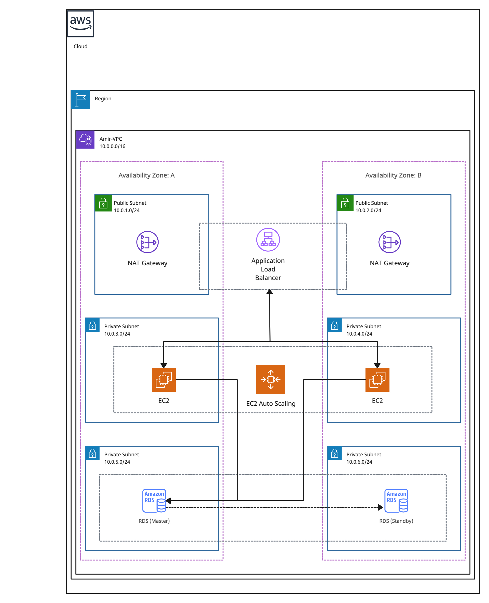

# Building a 3-Tier VPC in AWS

This guide will walk you through the process of creating a 3-tier Virtual Private Cloud (VPC) in Amazon Web Services (AWS). We'll cover both the AWS Management Console method and provide AWS CLI commands for those who prefer a command-line approach.

## Architecture Overview

Below is a diagram illustrating the 3-tier VPC architecture we'll be building:



This diagram shows the key components of our setup, including:
- Public and Private subnets across two Availability Zones
- Internet Gateway for public internet access
- NAT Gateways for outbound internet access from private subnets
- Application Load Balancer in the public subnets
- EC2 instances in each tier
- RDS instance in the private subnet

As we progress through this guide, we'll set up each of these components step by step.

## Table of Contents
1. [Overview of a 3-Tier VPC](#overview)
2. [Prerequisites](#prerequisites)
3. [Step-by-Step Guide](#guide)
   - [Step 1: Create the VPC](#step1)
     - [Understanding CIDR Blocks](#cidr-blocks)
   - [Step 2: Enable DNS Hostnames](#step2)
   - [Step 3: Create Internet Gateway](#step3)
   - [Step 4: Create Subnets](#step4)
   - [Step 5: Enable Auto-assign Public IP for Public Subnets](#step5)
   - [Step 6: Create and Configure Public Route Table](#step6)
   - [Step 7: Create NAT Gateways](#step7)
   - [Step 8: Create and Configure Private Route Tables](#step8)
   - [Step 9: Create Security Groups](#step9)
   - [Step 10: Launch EC2 Instances](#step10)
   - [Step 11: (Optional) Add an Application Load Balancer](#step11)
   - [Step 12: (Optional) Set up Amazon RDS](#step12)
   - [Step 13: (Optional) Configure Auto Scaling](#step13)
4. [Advanced Configurations and Best Practices](#step14)
5. [Extra Suggestions and Best Practices](#extra-suggestions)
6. [Cost Considerations and Optimization](#cost-considerations)
7. [Cleanup](#cleanup)
8. [Conclusion](#conclusion)


## Overview of a 3-Tier VPC <a name="overview"></a>

A 3-tier VPC typically consists of:
- Public tier (Web layer)
- Private tier (Application layer)
- Data tier (Database layer)

This architecture provides enhanced security and isolation for your applications.

## Prerequisites <a name="prerequisites"></a>

Before you begin, ensure you have the following:

1. An AWS account
2. AWS Management Console access
3. (Optional) AWS CLI installed and configured
   - To install the AWS CLI, follow the [official AWS CLI installation guide](https://docs.aws.amazon.com/cli/latest/userguide/getting-started-install.html)
   - After installation, configure the AWS CLI with your credentials:
     ```
     aws configure
     ```
   - You'll need to provide your AWS Access Key ID, Secret Access Key, default region name, and output format
4. Basic understanding of AWS networking concepts
5. Sufficient permissions to create and manage VPC resources

Note: If you're using the AWS CLI, make sure your configured credentials have the necessary permissions to create and manage VPC resources.


# Building a 3-Tier VPC in AWS

### Step 1: Create the VPC <a name="step1"></a>

#### Understanding CIDR Blocks

Before creating the VPC, it's important to understand CIDR (Classless Inter-Domain Routing) blocks:

- A CIDR block represents a range of IP addresses.
- The format is typically `x.x.x.x/y`, where `x.x.x.x` is the network address and `y` is the prefix length (also known as the subnet mask).
- The prefix length determines the number of available IP addresses.

For our VPC, we'll use `10.0.0.0/16`:
- This CIDR block provides 65,536 available IP addresses (2^(32-16) = 2^16 = 65,536).
- It includes all IP addresses from 10.0.0.0 to 10.0.255.255.

To calculate the number of available IP addresses for any CIDR block:
1. Subtract the prefix length from 32 (for IPv4).
2. Raise 2 to the power of this result.

For example:
- `/24` subnet: 2^(32-24) = 2^8 = 256 IP addresses
- `/28` subnet: 2^(32-28) = 2^4 = 16 IP addresses

#### Console Instructions:
1. Navigate to the VPC dashboard in the AWS Management Console
2. Click "Create VPC"
3. Choose "VPC and more"
4. Configure your VPC settings:
   - Name tag: My3TierVPC
   - IPv4 CIDR block: 10.0.0.0/16
5. Leave other settings as default and click "Create VPC"

#### CLI Command:
```bash
aws ec2 create-vpc --cidr-block 10.0.0.0/16 --tag-specifications 'ResourceType=vpc,Tags=[{Key=Name,Value=My3TierVPC}]'
```

This command creates a VPC with the CIDR block 10.0.0.0/16 and tags it with the name "My3TierVPC".

Note: When planning your VPC, ensure you choose a CIDR block that doesn't overlap with your other networks and provides enough IP addresses for your current and future needs.

--------------------------------------------------------------------------------

### Step 2: Enable DNS Hostnames <a name="step2"></a>

Enabling DNS hostnames is an important step in setting up your VPC. Here's why:

1. **Automatic DNS naming**: When enabled, EC2 instances in your VPC automatically receive DNS hostnames that correspond to their public IP addresses.

2. **Internal DNS resolution**: It allows instances within your VPC to resolve the DNS hostnames of other instances to their private IP addresses.

3. **Integration with other AWS services**: Many AWS services rely on DNS resolution. Enabling this feature ensures smoother integration with services like Amazon RDS, ElastiCache, and ELB.

4. **Simplified network management**: It makes it easier to reference instances by name rather than IP address, which can simplify network management and troubleshooting.

5. **Support for custom domain names**: If you plan to use custom domain names within your VPC, this feature is essential.

#### Console Instructions:
1. Select your VPC in the VPC dashboard
2. Click "Actions" and choose "Edit VPC settings"
3. Check the box for "Enable DNS hostnames"
4. Click "Save changes"

#### CLI Command:
```bash
aws ec2 modify-vpc-attribute --vpc-id <vpc-id> --enable-dns-hostnames "{\"Value\":true}"
```

This command enables DNS hostnames for your VPC.

--------------------------------------------------------------------------------

### Step 3: Create Internet Gateway <a name="step3"></a>

#### Console Instructions:
1. In the VPC dashboard, navigate to "Internet Gateways"
2. Click "Create internet gateway"
3. Name your internet gateway and create it
4. Select the newly created internet gateway
5. Click "Actions" and choose "Attach to VPC"
6. Select your VPC and click "Attach"

#### CLI Commands:
```bash
# Create Internet Gateway
aws ec2 create-internet-gateway --tag-specifications 'ResourceType=internet-gateway,Tags=[{Key=Name,Value=My3TierVPC-IGW}]'

# Attach Internet Gateway to VPC
aws ec2 attach-internet-gateway --vpc-id <vpc-id> --internet-gateway-id <igw-id>
```
These commands create an Internet Gateway and attach it to your VPC.

--------------------------------------------------------------------------------

### Step 4: Create Subnets <a name="step4"></a>

In this step, we'll create six subnets: two public subnets, two private (application) subnets, and two data subnets, spread across two Availability Zones for high availability.

#### Console Instructions:
1. In the VPC dashboard, navigate to "Subnets"
2. Click "Create subnet"
3. Select your VPC
4. Create the following subnets:
   - Public Subnet 1 (AZ1)
   - Public Subnet 2 (AZ2)
   - Private Subnet 1 (AZ1)
   - Private Subnet 2 (AZ2)
   - Data Subnet 1 (AZ1)
   - Data Subnet 2 (AZ2)
5. For each subnet, specify a unique CIDR block within your VPC CIDR range

#### CLI Commands:
```bash
# Create public subnets
aws ec2 create-subnet --vpc-id <vpc-id> --cidr-block 10.0.1.0/24 --availability-zone us-east-1a --tag-specifications 'ResourceType=subnet,Tags=[{Key=Name,Value=PublicSubnet1}]'
aws ec2 create-subnet --vpc-id <vpc-id> --cidr-block 10.0.2.0/24 --availability-zone us-east-1b --tag-specifications 'ResourceType=subnet,Tags=[{Key=Name,Value=PublicSubnet2}]'

# Create private (application) subnets
aws ec2 create-subnet --vpc-id <vpc-id> --cidr-block 10.0.3.0/24 --availability-zone us-east-1a --tag-specifications 'ResourceType=subnet,Tags=[{Key=Name,Value=PrivateSubnet1}]'
aws ec2 create-subnet --vpc-id <vpc-id> --cidr-block 10.0.4.0/24 --availability-zone us-east-1b --tag-specifications 'ResourceType=subnet,Tags=[{Key=Name,Value=PrivateSubnet2}]'

# Create data subnets
aws ec2 create-subnet --vpc-id <vpc-id> --cidr-block 10.0.5.0/24 --availability-zone us-east-1a --tag-specifications 'ResourceType=subnet,Tags=[{Key=Name,Value=DataSubnet1}]'
aws ec2 create-subnet --vpc-id <vpc-id> --cidr-block 10.0.6.0/24 --availability-zone us-east-1b --tag-specifications 'ResourceType=subnet,Tags=[{Key=Name,Value=DataSubnet2}]'
```

These commands create six subnets: two for each tier (public, private, and data) across two different Availability Zones. Adjust the CIDR blocks and Availability Zones as needed for your specific requirements.

Note: Ensure that your chosen CIDR blocks fit within your VPC's CIDR range and do not overlap.

--------------------------------------------------------------------------------

### Step 5: Enable Auto-assign Public IP for Public Subnets <a name="step5"></a>

Enabling auto-assign public IP for your public subnets is crucial for instances in these subnets to be accessible from the internet. Here's why this step is important:

1. **Internet Accessibility**: Instances launched in these subnets will automatically receive a public IP address, allowing them to be reached from the internet.
2. **Outbound Internet Access**: It enables instances to initiate outbound connections to the internet without the need for a NAT gateway.
3. **Simplified Configuration**: You don't need to manually assign Elastic IP addresses to instances that need to be publicly accessible.

#### Console Instructions:
1. In the VPC dashboard, navigate to "Subnets"
2. Select one of your public subnets
3. Click "Actions" and choose "Edit subnet settings"
4. Check the box for "Enable auto-assign public IPv4 address"
5. Click "Save"
6. Repeat for the other public subnet

#### CLI Commands:
```bash
# Enable auto-assign public IP for PublicSubnet1
aws ec2 modify-subnet-attribute --subnet-id <public-subnet-1-id> --map-public-ip-on-launch

# Enable auto-assign public IP for PublicSubnet2
aws ec2 modify-subnet-attribute --subnet-id <public-subnet-2-id> --map-public-ip-on-launch
```

These commands enable the auto-assign public IP feature for both of your public subnets.

--------------------------------------------------------------------------------

### Step 6: Create and Configure Public Route Table <a name="step6"></a>

Creating and configuring a route table for your public subnets is a crucial step in setting up your VPC. This route table will enable internet access for resources in your public subnets.

#### Why this step is important:
1. **Internet Access**: It allows resources in public subnets to access the internet.
2. **Inbound Traffic**: It enables incoming traffic from the internet to reach resources in public subnets.
3. **Subnet Association**: It defines which subnets are public by associating them with this route table.

#### Console Instructions:
1. In the VPC dashboard, navigate to "Route Tables"
2. Click "Create route table"
3. Name it (e.g., "Public Route Table") and select your VPC
4. Click "Create"
5. Select the newly created route table
6. In the "Routes" tab, click "Edit routes"
7. Add a new route:
   - Destination: 0.0.0.0/0
   - Target: Select your Internet Gateway
8. Click "Save routes"
9. In the "Subnet associations" tab, click "Edit subnet associations"
10. Select your public subnets and click "Save associations"

#### CLI Commands:
```bash
# Create the route table
aws ec2 create-route-table --vpc-id <vpc-id> --tag-specifications 'ResourceType=route-table,Tags=[{Key=Name,Value=Public Route Table}]'

# Add route to Internet Gateway
aws ec2 create-route --route-table-id <route-table-id> --destination-cidr-block 0.0.0.0/0 --gateway-id <internet-gateway-id>

# Associate public subnets with the route table
aws ec2 associate-route-table --route-table-id <route-table-id> --subnet-id <public-subnet-1-id>
aws ec2 associate-route-table --route-table-id <route-table-id> --subnet-id <public-subnet-2-id>
```

These commands create a new route table, add a route to the Internet Gateway, and associate it with your public subnets.

--------------------------------------------------------------------------------

### Step 7: Create NAT Gateways <a name="step7"></a>

NAT (Network Address Translation) Gateways allow instances in private subnets to access the internet or other AWS services while preventing the internet from initiating connections to these instances.

#### Why this step is important:
1. **Outbound Internet Access**: Enables instances in private subnets to access the internet for updates, patches, etc.
2. **Security**: Prevents inbound connections from the internet to your private instances.
3. **AWS Services Access**: Allows private instances to access AWS services that are outside your VPC.

#### Console Instructions:
1. Navigate to the VPC dashboard and select "NAT Gateways"
2. Click "Create NAT Gateway"
3. Select one of your public subnets
4. Click "Allocate Elastic IP" to assign a new Elastic IP to the NAT Gateway
5. Click "Create NAT Gateway"
6. Repeat steps 2-5 for the second public subnet in a different Availability Zone for high availability

#### CLI Commands:
```bash
# Allocate Elastic IPs
aws ec2 allocate-address --domain vpc

# Note the AllocationId from the output of the above command

# Create NAT Gateway in the first public subnet
aws ec2 create-nat-gateway --subnet-id <public-subnet-1-id> --allocation-id <elastic-ip-allocation-id-1> --tag-specifications 'ResourceType=natgateway,Tags=[{Key=Name,Value=NAT-Gateway-AZ1}]'

# Create NAT Gateway in the second public subnet (optional)
aws ec2 create-nat-gateway --subnet-id <public-subnet-2-id> --allocation-id <elastic-ip-allocation-id-2> --tag-specifications 'ResourceType=natgateway,Tags=[{Key=Name,Value=NAT-Gateway-AZ2}]'
```

These commands allocate Elastic IPs and create NAT Gateways in your public subnets.

Note: Creating NAT Gateways in multiple Availability Zones provides high availability for your private subnets. If one AZ goes down, the other NAT Gateway can handle the traffic.

Important: NAT Gateways are not included in the AWS free tier and will incur charges. Be sure to delete them and release your EIPs when they're not needed to avoid unnecessary costs.

--------------------------------------------------------------------------------

### Step 8: Create and Configure Private Route Table <a name="step8"></a>

A private route table is essential for controlling the traffic flow from your private subnets. It ensures that outbound internet traffic from private subnets is directed through the NAT Gateway.

#### Why this step is important:
1. **Controlled Internet Access**: Allows instances in private subnets to access the internet through the NAT Gateway.
2. **Isolation**: Keeps private subnets isolated from direct internet access.
3. **Simplified Management**: Using a single route table for all private subnets simplifies network management.

#### Console Instructions:
1. In the VPC dashboard, navigate to "Route Tables"
2. Click "Create route table"
3. Name it (e.g., "Private Route Table") and select your VPC
4. Click "Create"
5. Select the newly created route table
6. In the "Routes" tab, click "Edit routes"
7. Add a new route:
   - Destination: 0.0.0.0/0
   - Target: Select one of your NAT Gateways
8. Click "Save routes"
9. In the "Subnet associations" tab, click "Edit subnet associations"
10. Select all your private subnets (both app tier and database tier) and click "Save associations"

#### CLI Commands:
```bash
# Create private route table
aws ec2 create-route-table --vpc-id <vpc-id> --tag-specifications 'ResourceType=route-table,Tags=[{Key=Name,Value=Private Route Table}]'

# Add route to NAT Gateway
aws ec2 create-route --route-table-id <route-table-id> --destination-cidr-block 0.0.0.0/0 --nat-gateway-id <nat-gateway-id>

# Associate all private subnets with the route table
aws ec2 associate-route-table --route-table-id <route-table-id> --subnet-id <private-subnet-1-id>
aws ec2 associate-route-table --route-table-id <route-table-id> --subnet-id <private-subnet-2-id>
aws ec2 associate-route-table --route-table-id <route-table-id> --subnet-id <private-subnet-3-id>
aws ec2 associate-route-table --route-table-id <route-table-id> --subnet-id <private-subnet-4-id>
```

These commands create a single private route table, add a route to one of the NAT Gateways, and associate it with all private subnets.

Note: While we're using a single NAT Gateway for simplicity, in a production environment, you might want to use multiple NAT Gateways (one per AZ) for high availability. In that case, you would create separate route tables for each AZ, each pointing to its respective NAT Gateway.

--------------------------------------------------------------------------------

### Step 9: Create Security Groups <a name="step9"></a>

Security Groups act as a virtual firewall for your Amazon EC2 instances to control incoming and outgoing traffic. In a 3-tier architecture, we typically create separate security groups for each tier.

#### Why this step is important:
1. **Access Control**: Allows you to control which traffic (inbound and outbound) is allowed to reach your instances.
2. **Isolation**: Helps maintain the separation between tiers by controlling inter-tier communication.
3. **Defense in Depth**: Adds an additional layer of security to your VPC.

#### Console Instructions:
1. In the VPC dashboard, navigate to "Security Groups"
2. Click "Create security group"
3. Create the following security groups:

   a. Web Tier Security Group:
   - Name: Web-SG
   - Description: Allow HTTP/HTTPS from anywhere
   - VPC: Select your VPC
   - Inbound rules:
     - Allow HTTP (80) from anywhere
     - Allow HTTPS (443) from anywhere
   - Outbound rules: Allow all traffic

   b. Application Tier Security Group:
   - Name: App-SG
   - Description: Allow traffic from Web tier
   - VPC: Select your VPC
   - Inbound rules:
     - Allow custom TCP (e.g., 8080) from Web-SG
   - Outbound rules: Allow all traffic

   c. Database Tier Security Group:
   - Name: DB-SG
   - Description: Allow traffic from App tier
   - VPC: Select your VPC
   - Inbound rules:
     - Allow MySQL/Aurora (3306) from App-SG
   - Outbound rules: Allow all traffic

4. Click "Create security group" for each

#### CLI Commands:
```bash
# Create Web Tier Security Group
aws ec2 create-security-group --group-name Web-SG --description "Allow HTTP/HTTPS from anywhere" --vpc-id <vpc-id>
aws ec2 authorize-security-group-ingress --group-id <web-sg-id> --protocol tcp --port 80 --cidr 0.0.0.0/0
aws ec2 authorize-security-group-ingress --group-id <web-sg-id> --protocol tcp --port 443 --cidr 0.0.0.0/0

# Create Application Tier Security Group
aws ec2 create-security-group --group-name App-SG --description "Allow traffic from Web tier" --vpc-id <vpc-id>
aws ec2 authorize-security-group-ingress --group-id <app-sg-id> --protocol tcp --port 8080 --source-group <web-sg-id>

# Create Database Tier Security Group
aws ec2 create-security-group --group-name DB-SG --description "Allow traffic from App tier" --vpc-id <vpc-id>
aws ec2 authorize-security-group-ingress --group-id <db-sg-id> --protocol tcp --port 3306 --source-group <app-sg-id>
```

These commands create the security groups for each tier and set up the basic inbound rules. Adjust the ports as necessary for your specific application needs.

Note: The principle of least privilege should be applied when setting up security groups. Only open the ports that are absolutely necessary for your application to function.

--------------------------------------------------------------------------------

### Step 10: Launch EC2 Instances (Optional) <a name="step10"></a>

To test our VPC setup, we'll launch EC2 instances in each tier of our architecture. This step will help verify that our network configuration, routing, and security groups are working as expected.

#### Why this step is important:
1. **Validation**: Confirms that the VPC, subnets, route tables, and security groups are correctly configured.
2. **Testing**: Allows you to test connectivity between tiers and to the internet.
3. **Practical Application**: Provides a real-world example of how instances would be deployed in your VPC.

#### Console Instructions:
1. Navigate to the EC2 dashboard and click "Launch Instance"
2. Choose an Amazon Machine Image (AMI) and instance type
3. In the "Network" settings:
   - Select your VPC
   - Choose the appropriate subnet (public for web tier, private for app and DB tiers)
   - Auto-assign public IP: Enable for web tier, Disable for app and DB tiers
   - Select the corresponding security group for each tier
4. Add user data script if needed (e.g., to install a web server on the web tier instance)
5. Launch instances for each tier:
   - Web Tier: in a public subnet
   - App Tier: in a private subnet (app layer)
   - DB Tier: in a private subnet (data layer)

#### CLI Commands:
```bash
# Launch Web Tier Instance
aws ec2 run-instances --image-id ami-xxxxxxxx --count 1 --instance-type t2.micro --key-name MyKeyPair --security-group-ids <web-sg-id> --subnet-id <public-subnet-id> --associate-public-ip-address --user-data file://web-user-data.txt

# Launch App Tier Instance
aws ec2 run-instances --image-id ami-xxxxxxxx --count 1 --instance-type t2.micro --key-name MyKeyPair --security-group-ids <app-sg-id> --subnet-id <private-app-subnet-id> --no-associate-public-ip-address

# Launch DB Tier Instance
aws ec2 run-instances --image-id ami-xxxxxxxx --count 1 --instance-type t2.micro --key-name MyKeyPair --security-group-ids <db-sg-id> --subnet-id <private-db-subnet-id> --no-associate-public-ip-address
```

Replace `ami-xxxxxxxx` with an appropriate AMI ID for your region, `MyKeyPair` with your EC2 key pair name, and the subnet and security group IDs with the ones you created earlier.

Note: For the web-user-data.txt, you might include a script to install and start a web server, e.g.:
```bash
#!/bin/bash
yum update -y
yum install -y httpd
systemctl start httpd
systemctl enable httpd
```

After launching the instances:
1. Verify that you can connect to the web tier instance from the internet.
2. Use the web tier instance as a bastion host to connect to the app and DB tier instances.
3. Confirm that the app tier can reach the DB tier and the internet (for updates).
4. Check that the DB tier can reach the internet but is not directly accessible from it.

Remember to terminate these instances when you're done testing to avoid unnecessary charges.

--------------------------------------------------------------------------------

### Step 11: (Optional) Add an Application Load Balancer <a name="step11"></a>

Adding an Application Load Balancer (ALB) distributes incoming application traffic across multiple targets, such as EC2 instances, in multiple Availability Zones. This improves your application's fault tolerance.

#### Why this step is important:
1. **High Availability**: Distributes traffic across multiple instances and AZs.
2. **Scalability**: Easily add or remove instances as demand changes.
3. **Security**: Acts as a single point of entry, simplifying security management.

#### Console Instructions:
1. Navigate to the EC2 dashboard and select "Load Balancers"
2. Click "Create Load Balancer" and choose "Application Load Balancer"
3. Basic Configuration:
   - Name your ALB
   - Choose "Internet-facing"
   - Select your VPC
4. Network Mapping:
   - Select at least two public subnets from different AZs
5. Security Groups:
   - Create a new security group for the ALB:
     - Name: ALB-SG
     - Inbound rules: Allow HTTP (80) and HTTPS (443) from anywhere
     - Outbound rules: Allow all traffic
6. Listeners and Routing:
   - Protocol: HTTP, Port: 80
   - Create a target group:
     - Choose "Instances" as the target type
     - Name your target group
     - Protocol: HTTP, Port: 80 (or your application port)
     - Select your VPC
     - Configure health checks as needed
7. Register Targets:
   - Select the EC2 instances from your web tier
8. Review and Create

#### CLI Commands:
```bash
# Create ALB Security Group
aws ec2 create-security-group --group-name ALB-SG --description "Security group for ALB" --vpc-id <vpc-id>
aws ec2 authorize-security-group-ingress --group-id <alb-sg-id> --protocol tcp --port 80 --cidr 0.0.0.0/0
aws ec2 authorize-security-group-ingress --group-id <alb-sg-id> --protocol tcp --port 443 --cidr 0.0.0.0/0

# Create Target Group
aws elbv2 create-target-group --name my-targets --protocol HTTP --port 80 --vpc-id <vpc-id> --health-check-path /health

# Register targets
aws elbv2 register-targets --target-group-arn <target-group-arn> --targets Id=<instance-1-id> Id=<instance-2-id>

# Create Load Balancer
aws elbv2 create-load-balancer --name my-load-balancer --subnets <public-subnet-1-id> <public-subnet-2-id> --security-groups <alb-sg-id>

# Create Listener
aws elbv2 create-listener --load-balancer-arn <load-balancer-arn> --protocol HTTP --port 80 --default-actions Type=forward,TargetGroupArn=<target-group-arn>
```

Replace the placeholders with your actual VPC, subnet, security group, and instance IDs.

#### Update Web Tier Security Group
After creating the ALB, update the Web-SG to allow traffic only from the ALB:

Console:
1. Go to the EC2 dashboard > Security Groups
2. Select Web-SG
3. Edit inbound rules
4. Change the source for HTTP/HTTPS to the ALB-SG

CLI:
```bash
aws ec2 revoke-security-group-ingress --group-id <web-sg-id> --protocol tcp --port 80 --cidr 0.0.0.0/0
aws ec2 authorize-security-group-ingress --group-id <web-sg-id> --protocol tcp --port 80 --source-group <alb-sg-id>
```

Remember to update your DNS or use the ALB's DNS name to direct traffic to your application.

--------------------------------------------------------------------------------

### Step 12: (Optional) Set up Amazon RDS <a name="step12"></a>

Setting up an Amazon RDS instance provides a managed database solution for your application, completing the 3-tier architecture.

#### Why this step is important:
1. **Managed Service**: AWS handles routine database tasks, reducing administrative overhead.
2. **Scalability**: Easily scale your database as your application grows.
3. **High Availability**: Option to deploy across multiple Availability Zones for better fault tolerance.
4. **Security**: Integrates with VPC for network isolation and uses security groups for access control.

#### Console Instructions:
1. Navigate to the RDS dashboard
2. Click "Create database"
3. Choose a database creation method (Standard or Easy create)
4. Select your preferred database engine (e.g., MySQL, PostgreSQL)
5. Choose the Edition and Version
6. Select the DB instance size
7. Configure storage
8. Set up Multi-AZ deployment for high availability (if needed)
9. Network & Security:
   - VPC: Select your VPC
   - Subnet group: Create a new subnet group with your private subnets
   - Public access: No
   - VPC security group: Create new, name it RDS-SG
   - Availability Zone: No preference
10. Database authentication: Password authentication
11. Configure the database name, master username, and password
12. Additional configuration: adjust as needed (backup, monitoring, etc.)
13. Create database

#### CLI Commands:
```bash
# Create DB Subnet Group
aws rds create-db-subnet-group --db-subnet-group-name mydbsubnetgroup --db-subnet-group-description "Subnet group for RDS" --subnet-ids <private-subnet-1-id> <private-subnet-2-id>

# Create RDS Security Group
aws ec2 create-security-group --group-name RDS-SG --description "Security group for RDS" --vpc-id <vpc-id>

# Allow inbound traffic from App-SG to RDS-SG
aws ec2 authorize-security-group-ingress --group-id <rds-sg-id> --protocol tcp --port 3306 --source-group <app-sg-id>

# Create RDS instance
aws rds create-db-instance \
    --db-instance-identifier mydbinstance \
    --db-instance-class db.t3.micro \
    --engine mysql \
    --master-username admin \
    --master-user-password <password> \
    --allocated-storage 20 \
    --vpc-security-group-ids <rds-sg-id> \
    --db-subnet-group-name mydbsubnetgroup \
    --no-publicly-accessible
```

Replace placeholders with your actual VPC, subnet, and security group IDs.

#### Update App Tier Security Group
Update the App-SG to allow outbound traffic to the RDS-SG:

Console:
1. Go to the EC2 dashboard > Security Groups
2. Select App-SG
3. Edit outbound rules
4. Add a rule: MySQL/Aurora (3306), Destination: RDS-SG

CLI:
```bash
aws ec2 authorize-security-group-egress --group-id <app-sg-id> --protocol tcp --port 3306 --source-group <rds-sg-id>
```

Remember to update your application's database connection settings to use the new RDS endpoint.

--------------------------------------------------------------------------------

### Step 13: (Optional) Configure Auto Scaling <a name="step13"></a>

Auto Scaling helps you maintain application availability and allows you to automatically adjust the number of EC2 instances in your application tier based on defined conditions.

#### Why this step is important:
1. **High Availability**: Automatically replaces unhealthy instances.
2. **Cost Optimization**: Scales in during low-demand periods to reduce costs.
3. **Improved Performance**: Scales out during high-demand periods to maintain performance.
4. **Automation**: Reduces manual intervention in capacity planning.

#### Console Instructions:
1. Navigate to the EC2 dashboard and select "Auto Scaling Groups"
2. Click "Create Auto Scaling group"
3. Choose launch template or configuration:
   - Click "Create a launch template"
   - Name your template
   - Select the AMI and instance type
   - Select the VPC and subnet(s) for your application tier
   - Select the App-SG security group
   - Add any necessary user data scripts
   - Create the launch template
4. Configure Auto Scaling group details:
   - Name your Auto Scaling group
   - Select the VPC and subnets for your application tier
5. Configure advanced options:
   - Attach to an existing load balancer, select your ALB target group
   - Enable health checks from the load balancer
6. Configure group size and scaling policies:
   - Set minimum, maximum, and desired capacity
   - Select scaling policies (e.g., target tracking scaling policy)
7. Add notifications if desired
8. Add tags if needed
9. Review and create

#### CLI Commands:
```bash
# Create Launch Template
aws ec2 create-launch-template \
    --launch-template-name my-launch-template \
    --version-description v1 \
    --launch-template-data '{"ImageId":"ami-xxxxxxxxxxxxxxxxx","InstanceType":"t2.micro","SecurityGroupIds":["sg-xxxxxxxxxxxxxxxxx"],"UserData":"BASE64ENCODED_USER_DATA"}'

# Create Auto Scaling Group
aws autoscaling create-auto-scaling-group \
    --auto-scaling-group-name my-asg \
    --launch-template LaunchTemplateName=my-launch-template,Version='$Latest' \
    --min-size 2 \
    --max-size 5 \
    --desired-capacity 2 \
    --vpc-zone-identifier "subnet-xxxxxxxxxxxxxxxxx,subnet-yyyyyyyyyyyyyyyyy" \
    --target-group-arns arn:aws:elasticloadbalancing:region:account-id:targetgroup/my-targets/xxxxxxxxxxxxxxxxx \
    --health-check-type ELB \
    --health-check-grace-period 300

# Create Scaling Policy
aws autoscaling put-scaling-policy \
    --auto-scaling-group-name my-asg \
    --policy-name my-scaling-policy \
    --policy-type TargetTrackingScaling \
    --target-tracking-configuration '{"TargetValue": 50.0,"PredefinedMetricSpecification": {"PredefinedMetricType": "ASGAverageCPUUtilization"}}'
```

Replace placeholders with your actual AMI ID, security group ID, subnet IDs, and target group ARN.

#### Update Security Group
Ensure that your App-SG allows traffic from the ALB-SG:

Console:
1. Go to the EC2 dashboard > Security Groups
2. Select App-SG
3. Edit inbound rules
4. Add a rule: HTTP (80), Source: ALB-SG

CLI:
```bash
aws ec2 authorize-security-group-ingress --group-id <app-sg-id> --protocol tcp --port 80 --source-group <alb-sg-id>
```

Remember to update your application deployment process to work with Auto Scaling. This might involve creating AMIs or using a configuration management tool to set up new instances as they're launched.

--------------------------------------------------------------------------------

### Step 14: Advanced Configurations and Best Practices <a name="step14"></a>

After setting up the basic 3-tier VPC architecture, consider implementing these advanced configurations and best practices to enhance security, performance, and manageability.

#### 1. Implement VPC Flow Logs
VPC Flow Logs capture information about IP traffic going to and from network interfaces in your VPC.

Console: VPC Dashboard > Your VPC > Flow logs > Create flow log
CLI:
```bash
aws ec2 create-flow-logs --resource-type VPC --resource-id <vpc-id> --traffic-type ALL --log-destination-type cloud-watch-logs --log-group-name VPCFlowLogs
```

#### 2. Set up VPC Endpoints
VPC Endpoints allow you to privately connect your VPC to supported AWS services without requiring an internet gateway or NAT device.

Console: VPC Dashboard > Endpoints > Create Endpoint
CLI (example for S3):
```bash
aws ec2 create-vpc-endpoint --vpc-id <vpc-id> --service-name com.amazonaws.<region>.s3 --route-table-ids <private-route-table-id>
```

#### 3. Implement Network ACLs
Network ACLs provide an additional layer of security at the subnet level.

Console: VPC Dashboard > Network ACLs > Create Network ACL
CLI:
```bash
aws ec2 create-network-acl --vpc-id <vpc-id>
```

#### 4. Enable VPC Peering (if needed)
VPC Peering allows you to connect one VPC with another via a direct network route using private IP addresses.

Console: VPC Dashboard > Peering Connections > Create Peering Connection
CLI:
```bash
aws ec2 create-vpc-peering-connection --vpc-id <vpc-id> --peer-vpc-id <peer-vpc-id>
```

#### 5. Set up AWS Site-to-Site VPN
If you need to connect your VPC to an on-premises network, consider setting up a Site-to-Site VPN.

Console: VPC Dashboard > Site-to-Site VPN Connections > Create VPN Connection
CLI:
```bash
aws ec2 create-vpn-gateway --type ipsec.1
aws ec2 attach-vpn-gateway --vpn-gateway-id <vpn-gateway-id> --vpc-id <vpc-id>
```

#### 6. Implement AWS Direct Connect
For high-bandwidth, low-latency connections to AWS, consider setting up AWS Direct Connect.

This typically involves working with an AWS Direct Connect Partner and can't be fully automated through the console or CLI.

#### 7. Use AWS Transit Gateway
If you have multiple VPCs or need to connect to multiple on-premises locations, consider using AWS Transit Gateway for simplified management.

Console: VPC Dashboard > Transit Gateways > Create Transit Gateway
CLI:
```bash
aws ec2 create-transit-gateway
```

#### 8. Implement Proper Tagging Strategy
Implement a consistent tagging strategy for all your VPC resources to help with organization, cost allocation, and access control.

#### 9. Set up CloudWatch Alarms
Create CloudWatch Alarms to monitor your VPC resources and get notified of any issues.

#### 10. Regular Security Audits
Regularly review your VPC configuration, security groups, NACLs, and other settings to ensure they align with security best practices.

Remember, these advanced configurations should be implemented based on your specific needs and use cases. Always consider the principle of least privilege and only implement what is necessary for your application architecture.

--------------------------------------------------------------------------------

### Extra Suggestions and Best Practices <a name="extra-suggestions"></a>

To further enhance your 3-tier VPC setup, consider the following suggestions:

1. **Use AWS Systems Manager Session Manager**: Instead of using bastion hosts, consider using AWS Systems Manager Session Manager for secure shell access to your instances in private subnets. This eliminates the need to open inbound SSH ports.

2. **Implement AWS WAF**: If you're using an Application Load Balancer, consider implementing AWS WAF (Web Application Firewall) to protect your web applications from common web exploits.

3. **Enable VPC Flow Logs**: Use VPC Flow Logs to capture information about IP traffic going to and from network interfaces in your VPC. This can be crucial for troubleshooting and security analysis.

4. **Use AWS Config**: Implement AWS Config to assess, audit, and evaluate the configurations of your AWS resources, including VPC components.

5. **Implement Cross-Zone Load Balancing**: If you're using an ALB, ensure cross-zone load balancing is enabled for even distribution of traffic across all registered instances in all enabled Availability Zones.

6. **Use Elastic IP for NAT Gateways**: Assign Elastic IPs to your NAT Gateways. This ensures that the public IP address doesn't change if the NAT Gateway is stopped and started.

7. **Implement AWS Secrets Manager**: Use AWS Secrets Manager to protect sensitive information such as database credentials, API keys, and other secrets.

8. **Set up CloudWatch Dashboards**: Create custom CloudWatch dashboards to monitor all aspects of your VPC and the applications running within it.

9. **Use VPC Endpoints**: Implement VPC Endpoints for AWS services like S3 and DynamoDB to keep traffic between your VPC and these services within the AWS network.

10. **Implement Multi-AZ for RDS**: If you're using RDS, consider enabling Multi-AZ deployment for increased availability and durability.

11. **Use Transit Gateway for complex networking**: If you plan to connect multiple VPCs or on-premises networks, consider using AWS Transit Gateway for simplified management.

12. **Implement CI/CD pipeline**: Set up a CI/CD pipeline using services like AWS CodePipeline, CodeBuild, and CodeDeploy to automate your application deployments.

13. **Use Infrastructure as Code**: Consider using AWS CloudFormation or Terraform to manage your infrastructure as code. This enables version control of your infrastructure and simplifies replication and updates.

14. **Implement AWS Shield**: For protection against DDoS attacks, consider implementing AWS Shield, especially if you're dealing with critical applications.

15. **Regular Security Audits**: Schedule regular security audits of your VPC configuration, including a review of security groups, NACLs, and IAM permissions.

Remember, while these suggestions can greatly enhance your setup, implement them based on your specific needs and always consider the associated costs and complexity.

--------------------------------------------------------------------------------

### Cost Considerations and Optimization <a name="cost-considerations"></a>

When implementing a 3-tier VPC architecture in AWS, it's important to be aware of the costs involved and how to optimize them:

1. **NAT Gateway Costs**: NAT Gateways can be expensive. Consider using NAT Instances for dev/test environments or low-traffic scenarios.

2. **Elastic IP Charges**: You're charged for Elastic IPs that are not associated with running instances. Always release unused Elastic IPs.

3. **EC2 Instance Sizing**: Regularly review your EC2 instance sizes. Use AWS Cost Explorer and CloudWatch metrics to identify underutilized instances and downsize them if possible.

4. **Auto Scaling**: Implement Auto Scaling to automatically adjust capacity based on demand, potentially reducing costs during low-traffic periods.

5. **Reserved Instances**: For predictable workloads, consider purchasing Reserved Instances to significantly reduce EC2 costs.

6. **Savings Plans**: Explore AWS Savings Plans for a flexible pricing model that can provide savings on EC2, Fargate, and Lambda usage.

7. **RDS Optimization**: If using RDS, consider scaling vertically (increasing instance size) before scaling horizontally (read replicas) to optimize costs.

8. **S3 Lifecycle Policies**: If storing data in S3, implement lifecycle policies to automatically move infrequently accessed data to cheaper storage tiers.

9. **CloudWatch Costs**: Be mindful of CloudWatch costs, especially if implementing detailed monitoring. Standard monitoring might be sufficient for many use cases.

10. **Data Transfer Costs**: Be aware of data transfer costs, especially for traffic between AZs or outbound internet traffic. Try to keep traffic within the same AZ when possible.

11. **AWS Budgets**: Set up AWS Budgets to track your spending and get notified when you exceed (or are forecasted to exceed) your budgeted amount.

12. **Cost Allocation Tags**: Use cost allocation tags to track AWS costs on a detailed level, which can help identify areas for optimization.

Remember, while optimizing costs is important, it shouldn't come at the expense of the reliability, performance, or security of your architecture. Always balance cost optimization with your application's requirements.

--------------------------------------------------------------------------------

## Conclusion <a name="conclusion"></a>

Congratulations! You've now gone through a comprehensive guide on setting up a 3-tier VPC architecture in AWS. Let's recap what we've covered:

1. We started with the basics of creating a VPC, setting up Internet and NAT Gateways, and configuring subnets and route tables.
2. We then moved on to creating security groups and launching EC2 instances in each tier.
3. We explored optional components like adding an Application Load Balancer, setting up an Amazon RDS instance, and configuring Auto Scaling.
4. We delved into advanced configurations and best practices to enhance your VPC setup.
5. We provided extra suggestions to further optimize and secure your architecture.
6. Finally, we discussed important cost considerations to help you manage and optimize your AWS spending.

This 3-tier VPC architecture provides a solid foundation for hosting scalable, secure, and highly available applications on AWS. However, remember that this is a starting point. As your application grows and your requirements evolve, you may need to adapt and expand this architecture.

Key takeaways:
- Always prioritize security in your design decisions.
- Regularly review and optimize your setup for performance and cost-efficiency.
- Stay updated with AWS best practices and new service offerings that could benefit your architecture.
- Consider using Infrastructure as Code for managing your VPC setup, especially for production environments.
- Implement proper monitoring and alerting to ensure the health and performance of your infrastructure.

Remember, building a robust cloud infrastructure is an iterative process. Continually assess your architecture against your business needs, security requirements, and AWS's latest offerings.

I hope this guide has provided you with a comprehensive understanding of setting up a 3-tier VPC in AWS. As you implement this architecture, don't hesitate to refer back to specific sections as needed. Good luck with your AWS journey!

--------------------------------------------------------------------------------

## Cleanup <a name="cleanup"></a>

When you're done experimenting with your 3-tier VPC setup, it's important to clean up your resources to avoid ongoing charges. Below are instructions for both the AWS CLI and the AWS Management Console.

### AWS Management Console Cleanup

1. EC2 Instances:
   - Navigate to EC2 > Instances
   - Select all instances related to this VPC
   - Actions > Instance State > Terminate

2. Auto Scaling Group (if created):
   - Navigate to EC2 > Auto Scaling Groups
   - Select your Auto Scaling Group
   - Actions > Delete

3. Launch Template (if created):
   - Navigate to EC2 > Launch Templates
   - Select your Launch Template
   - Actions > Delete template

4. Load Balancer (if created):
   - Navigate to EC2 > Load Balancers
   - Select your Load Balancer
   - Actions > Delete

5. Target Group (if created):
   - Navigate to EC2 > Target Groups
   - Select your Target Group
   - Actions > Delete

6. RDS Instance (if created):
   - Navigate to RDS > Databases
   - Select your DB instance
   - Actions > Delete

7. NAT Gateways:
   - Navigate to VPC > NAT Gateways
   - Select each NAT Gateway
   - Actions > Delete NAT Gateway

8. Elastic IPs:
   - Navigate to VPC > Elastic IPs
   - Select each Elastic IP
   - Actions > Release Elastic IP address

9. Subnets:
   - Navigate to VPC > Subnets
   - Select each subnet associated with your VPC
   - Actions > Delete subnet

10. Route Tables:
    - Navigate to VPC > Route Tables
    - Select each custom route table
    - Actions > Delete route table

11. Internet Gateway:
    - Navigate to VPC > Internet Gateways
    - Select your Internet Gateway
    - Actions > Detach from VPC
    - After detaching, select it again and choose Actions > Delete Internet Gateway

12. Security Groups:
    - Navigate to EC2 > Security Groups
    - Select each custom security group
    - Actions > Delete security group
    
13. VPC:
    - Navigate to VPC > Your VPCs
    - Select your VPC
    - Actions > Delete VPC

Remember to delete resources in the correct order, as some resources may have dependencies on others. Always double-check that all resources have been properly deleted to avoid any unexpected charges.

Note: This cleanup process will permanently delete all the resources and data associated with this VPC setup. Make sure you have backed up any important data before proceeding with the cleanup.


## AWS CLI Cleanup <a name="cleanup"></a>

When you're done experimenting with your 3-tier VPC setup, it's important to clean up your resources to avoid ongoing charges. Here's a step-by-step guide to removing all the resources we created:

1. Delete EC2 Instances:
   ```bash
   aws ec2 terminate-instances --instance-ids <instance-id-1> <instance-id-2> <instance-id-3>
   ```

2. Delete Auto Scaling Group (if created):
   ```bash
   aws autoscaling delete-auto-scaling-group --auto-scaling-group-name my-asg --force-delete
   ```

3. Delete Launch Template (if created):
   ```bash
   aws ec2 delete-launch-template --launch-template-name my-launch-template
   ```

4. Delete Load Balancer (if created):
   ```bash
   aws elbv2 delete-load-balancer --load-balancer-arn <load-balancer-arn>
   ```

5. Delete Target Group (if created):
   ```bash
   aws elbv2 delete-target-group --target-group-arn <target-group-arn>
   ```

6. Delete RDS Instance (if created):
   ```bash
   aws rds delete-db-instance --db-instance-identifier mydbinstance --skip-final-snapshot
   ```

7. Delete NAT Gateways:
   ```bash
   aws ec2 delete-nat-gateway --nat-gateway-id <nat-gateway-id-1>
   aws ec2 delete-nat-gateway --nat-gateway-id <nat-gateway-id-2>
   ```

8. Release Elastic IPs:
   ```bash
   aws ec2 release-address --allocation-id <elastic-ip-allocation-id-1>
   aws ec2 release-address --allocation-id <elastic-ip-allocation-id-2>
   ```

9. Delete Subnets:
   ```bash
   aws ec2 delete-subnet --subnet-id <subnet-id-1>
   aws ec2 delete-subnet --subnet-id <subnet-id-2>
   # Repeat for all subnets
   ```

10. Delete Route Tables:
    ```bash
    aws ec2 delete-route-table --route-table-id <route-table-id-1>
    aws ec2 delete-route-table --route-table-id <route-table-id-2>
    ```

11. Detach and Delete Internet Gateway:
    ```bash
    aws ec2 detach-internet-gateway --internet-gateway-id <igw-id> --vpc-id <vpc-id>
    aws ec2 delete-internet-gateway --internet-gateway-id <igw-id>
    ```

12. Delete Security Groups:
    ```bash
    aws ec2 delete-security-group --group-id <web-sg-id>
    aws ec2 delete-security-group --group-id <app-sg-id>
    aws ec2 delete-security-group --group-id <db-sg-id>
    aws ec2 delete-security-group --group-id <alb-sg-id>
    aws ec2 delete-security-group --group-id <rds-sg-id>
    ```

13. Finally, Delete the VPC:
    ```bash
    aws ec2 delete-vpc --vpc-id <vpc-id>
    ```

Remember to replace the placeholder IDs with your actual resource IDs. Also, ensure that you delete resources in the correct order, as some resources may have dependencies on others.

Note: This cleanup process will permanently delete all the resources and data associated with this VPC setup. Make sure you have backed up any important data before proceeding with the cleanup.

Always double-check your AWS Console after running these commands to ensure all resources have been properly deleted and to avoid any unexpected charges.

--------------------------------------------------------------------------------

### Final Note

Thank you for using this guide! If you have any questions, suggestions, or feedback, please don't hesitate to reach out. You can contact me at amir.malaeb@gmail.com.

This guide is available as an open resource. Feel free to use, share, and contribute to it.

Remember, while this guide aims to be comprehensive, AWS services and best practices evolve over time. Always refer to the official AWS documentation for the most up-to-date information.

Happy cloud architecting!
