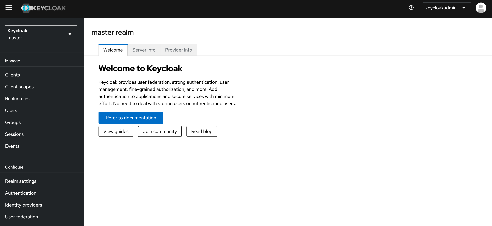

# How to deploy Keycloak in an AWS ECS cluster

Keycloak is an open-source identity and access management solution that offers authentication and authorization capabilities. It provides features such as single sign-on (SSO), user federation, identity brokering and social login. 

Amazon Elastic Container Service (ECS) is a fully managed container orchestration service provided by AWS. It allows you to run and manage Docker containers on a cluster of Amazon EC2 instances or using AWS Fargate, which is a serverless compute engine for containers.

This project contains a Docker file to build a Docker image for Keycloak and two AWS CloudFormation templates to deploy Keycloak on ECS running with Fargate and RDS PostgreSQL database.

The first template prepares the infrastructure for the deployment. It creates a VPC with public and private subnets, Internet Gateway, NAT Gateways and a RDS PostgreSQL instance for Keycloak.

The second template deploys an ECS cluster with a Keycloak service running on Fargate, an Auto Scaling group for the ECS tasks, an Application Load Balancer (ALB) and Route 53 DNS configuration.

Here is the architecture diagram of the solution:


### Prerequisites to deploy this solution
- AWS account with appropriate permissions. We are using us-east-1 region in this project but you can use your region of choice
- Basic understanding of AWS services
- AWS CLI installed and configured. All the command lines will be run from the current directory.
- Docker

## 1. Docker image

We will use this [Dockerfile](docker/Dockerfile) to build the Keycloak container image. The image is based on the official Keycloak image and includes the necessary configurations to run the Keycloak server. We will store the image in Amazon Elastic Container Registry (ECR) so that it can be easily pulled during the deployment of the ECS service.

### 1.1 Create the Amazon ECR repository
```bash
aws ecr create-repository --repository-name dev-keycloak --image-scanning-configuration scanOnPush=true --region us-east-1
```

### 1.2 Build the Docker image
```bash
docker build -t dev-keycloak ./docker
```

### 1.3 Tag the Docker image
```bash
docker tag dev-keycloak:latest <your-account-number>.dkr.ecr.us-east-1.amazonaws.com/dev-keycloak
```

### 1.4 Login into Amazon ECR
```bash
aws ecr get-login-password --region us-east-1 | docker login --username AWS --password-stdin <your-account-number>.dkr.ecr.us-east-1.amazonaws.com
```

### 1.5 Push the image to Amazon ECR
```bash
docker push <your-account-number>.dkr.ecr.us-east-1.amazonaws.com/dev-keycloak
```

## 2. CloudFormation Template to build the infrastructure (VPC, RDS database)

We will use the [keycloak-vpc-rds.yaml](cloudformation/keycloak-vpc-rds.yaml) template to create a VPC with public and private subnets, Internet Gateway, NAT Gateways, and an RDS PostgreSQL instance. It will also creates the necessary security groups and Secrets Manager secrets for RDS and Keycloak. This will be used as a foundation for deploying the Keycloak application on ECS.

### 2.1 Parameters

The template accepts the following parameters:

| Parameter Name          | Description                                                                 | Type   | Default Value  |
|-------------------------|-----------------------------------------------------------------------------|--------|----------------|
| `ProjectName`           | The project name that is prefixed to resource names                         | String | `keycloak`     |
| `VpcCIDR`               | The IP range (CIDR notation) for this VPC                                   | String | `10.0.0.0/16`  |
| `PublicSubnet1CIDR`     | The IP range (CIDR notation) for the public subnet in the first Availability Zone | String | `10.0.1.0/24`  |
| `PublicSubnet2CIDR`     | The IP range (CIDR notation) for the public subnet in the second Availability Zone | String | `10.0.2.0/24`  |
| `ECSPrivateSubnet1CIDR` | The IP range (CIDR notation) for the ECS private subnet in the first Availability Zone | String | `10.0.3.0/24`  |
| `ECSPrivateSubnet2CIDR` | The IP range (CIDR notation) for the ECS private subnet in the second Availability Zone | String | `10.0.4.0/24`  |
| `RDSPrivateSubnet1CIDR` | The IP range (CIDR notation) for the RDS private subnet in the first Availability Zone | String | `10.0.5.0/24`  |
| `RDSPrivateSubnet2CIDR` | The IP range (CIDR notation) for the RDS private subnet in the second Availability Zone | String | `10.0.6.0/24`  |
| `DBInstanceIdentifier`  | The database instance identifier                                            | String | `keycloakdb-instance` |
| `DBName`                | The name of the database to create in the RDS instance                      | String | `keycloakdb`   |
| `DBUser`                | The database admin account username (Password will be generated by Secrets Manager)                                    | String | `dbadmin`      |
| `DBAllocatedStorage`    | The allocated storage size for the RDS instance (in GB)                     | Number | `20`           |
| `DBInstanceClass`       | The instance class for the RDS instance                                     | String | `db.t3.micro`  |
| `KeycloakAdminUsername` | The admin username for Keycloak (Password will be generated by Secrets Manager)                                            | String | `keycloakadmin`        |
| `DomainName` | The domain name that will be used to create a certificate in AWS Certificate Manager (ACM) for the ALB                                            | String |        |
| `HostedZoneId` | The ID of the Route 53 Hosted Zone of the domain to create a certificate in AWS Certificate Manager (ACM)                                            | String |       |

### 2.2 Resources
The template creates the following resources:

- **ECS Task Execution Role**: IAM role that allows the ECS tasks to make API requests to AWS services.
- **VPC**: Virtual network with the specified CIDR block. DNS hostnames and DNS support are enabled.
- **Internet Gateway**: Internet gateway for internet access to the VPC.
- **Public Subnet 1**: Public subnet in the first Availability Zone. This will used by the Application Load Balancer (ALB) and the NAT Gateway.
- **Public Subnet 2**: Public subnet in the second Availability Zone for high availability and fault tolerance.
- **ECS Private Subnet 1**: Private subnet for the ECS tasks in the first Availability Zone.
- **ECS Private Subnet 2**: Private subnet for the ECS tasks in the second Availability Zone for high availability and fault tolerance.
- **RDS Private Subnet 1**: Private subnet for RDS instance in the first Availability Zone.
- **RDS Private Subnet 2**: Private subnet for RDS instance in the second Availability Zone for high availability and fault tolerance.
- **Nat Gateway 1**: Nat Gateway to provide outgoing internet access to the ECS task in the private subnet in the first Availability Zone.
- **Nat Gateway 2**: Nat Gateway to provide outgoing internet access to the ECS task in the private subnet in the second Availability Zone.
- **Public Route Table**: Public route table associated with the public subnets to allow traffic to flow to the Internet.
- **Private Route Table**: Private route table associated with the ECS private subnets to allow the tasks in the private subnet to have outgoing access to the Internet through the NAT Gateway.
- **ALB Security Group**: Security group used by the Application Load Balancer to allow traffic on port 443 (HTTPS) from anywhere in the internet.
- **ECS Security Group**: Security group to allow the ALB to communicate with the ECS tasks on port 8080 for Keycloak application and on port 9000 for the Keycloak health check.
- **RDS Security Group**: Security group to allow the ECS tasks to communicate with the RDS instance on port 5432.
- **DB Subnet Group**:Subnet group for the RDS instance. The RDS instances will be created in the RDS private subnets in the two Availability Zones (Multi AZ).
- **DB Secret**: Secret in AWS Secrets Manager to store the RDS admin credentials.
- **Keycloak Secret**: Secret in AWS Secrets Manager to store the Keycloak admin credentials.
- **RDS Instance**: RDS PostgreSQL instance with Multi-AZ enabled for high availability and fault tolerance.
- **Certificate**: AWS Certificate Manager (ACM) public certificate for the specified domain name using DNS validation. This certificate will be used by the Application Load Balancer to enable HTTPS traffic.

### 2.3 Outputs
The template provides the following outputs:

| Output Name           | Description                                |
|-----------------------|--------------------------------------------|
| `RDSInstanceEndpoint` | The endpoint of the RDS instance           |
| `DBSecretArn`         | The ARN of the database secret             |
| `KeycloakSecretArn`   | The ARN of the Keycloak secret             |
| `CertificateArn`      | The ARN of the ACM certificate             |

### 2.4 Usage
You can deploy this CloudFormation template by using the AWS Management Console or running the following command. Replace "your-domain-name" and "your-hosted-zone-id" with your actual domain name and hosted zone ID and adjust the other parameters with your preference.

```bash
aws cloudformation create-stack --stack-name keycloak-vpc-rds --template-body file://cloudformation/keycloak-vpc-rds.yaml --parameters ParameterKey=ProjectName,ParameterValue=keycloak ParameterKey=VpcCIDR,ParameterValue=10.0.0.0/16 ParameterKey=PublicSubnet1CIDR,ParameterValue=10.0.1.0/24 ParameterKey=PublicSubnet2CIDR,ParameterValue=10.0.2.0/24 ParameterKey=ECSPrivateSubnet1CIDR,ParameterValue=10.0.3.0/24 ParameterKey=ECSPrivateSubnet2CIDR,ParameterValue=10.0.4.0/24 ParameterKey=RDSPrivateSubnet1CIDR,ParameterValue=10.0.5.0/24 ParameterKey=RDSPrivateSubnet2CIDR,ParameterValue=10.0.6.0/24 ParameterKey=DBInstanceIdentifier,ParameterValue=keycloakdb-instance ParameterKey=DBName,ParameterValue=keycloakdb ParameterKey=DBUser,ParameterValue=dbadmin ParameterKey=DBAllocatedStorage,ParameterValue=20 ParameterKey=DBInstanceClass,ParameterValue=db.t3.micro ParameterKey=KeycloakAdminUsername,ParameterValue=keycloakadmin ParameterKey=DomainName,ParameterValue=<your-domain-name> ParameterKey=HostedZoneId,ParameterValue=<your-hosted-zone-id> --capabilities CAPABILITY_NAMED_IAM
```

## 3. CloudFormation Templates to deploy the Keycloak service in ECS

We will use the [keycloak-ecs-alb.yaml](cloudformation/keycloak-ecs-alb.yaml) template to create an ECS cluster with a Keycloak service running on Fargate, an Application Load Balancer, and a Route 53 alias record for the domain name. The template also creates an Auto Scaling Group to scale the Keycloak service based on CPU utilization. The Keycloak service is exposed through the Application Load Balancer with HTTPS listener. SSL termination is done on the Load Balancer and we use HTTP between the Load Balancer and the ECS task.

### 3.1 Parameters

The template accepts the following parameters:

| Parameter Name          | Description                                           | Type                         |
|-------------------------|-------------------------------------------------------|------------------------------|
| `VPCId`                 | The ID of the VPC                                     | `AWS::EC2::VPC::Id`          |
| `PublicSubnetIds`       | The list of Public Subnet IDs to use for the Load Balancer   | `List<AWS::EC2::Subnet::Id>` |
| `ECSPrivateSubnetIds`   | The list of Private Subnet IDs to use for the ECS tasks      | `List<AWS::EC2::Subnet::Id>` |
| `ALBSecurityGroupId`    | The ID of the Load Balancer Security Group            | `AWS::EC2::SecurityGroup::Id`|
| `ECSSecurityGroupId`    | The ID of the ECS task Security Group                 | `AWS::EC2::SecurityGroup::Id`|
| `HostedZoneId`          | The ID of the Route 53 Hosted Zone                    | `String`                     |
| `DomainName`            | The domain name that will be used to access the Keycloak application                 | `String`                     |
| `RDSInstanceEndpoint`            | The RDS instance endpoint for Keycloak database                 | `String`                     |
| `DBSecretArn`            | The ARN of the secret in AWS Secrets Manager that contains the database credentials                 | `String`                     |
| `KeycloakSecretArn`            | The ARN of the secret in AWS Secrets Manager that contains the Keycloak credentials                 | `String`                     |
| `CertificateArn`            | The ARN of the SSL/TLS certificate in AWS Certificate Manager (ACM)                 | `String`                     |

### 3.2 Resources
The template creates the following resources:

- **Keycloak Log Group**: Keycloak Log Group named "/ecs/dev-keycloak" that will contain the ECS Tasks logs in CloudWatch
- **ECS Cluster**: ECS cluster to run the Keycloak service on Fargate.
- **Keycloak Task Definition**: Defines the task definition for the Keycloak service, including container configurations and environment variables.
- **Keycloak Service**: ECS service to run the Keycloak tasks on Fargate.
- **Keycloak Scalable Target**: Configures auto-scaling for the Keycloak service based on CPU utilization. The minimum capacity is set to 1 task and the maximum capacity 5 tasks.
- **Keycloak Load Balancer**: Application Load Balancer (ALB) to distribute traffic to the Keycloak tasks.
- **Keycloak Target Group**: Target group for the Keycloak service, used by the ALB to route traffic to the ECS tasks.
- **Keycloak Listener**: ALB listener to listens on port 443 (HTTPS) and forward traffic to the Keycloak target group.
- **Route 53 Alias Record**: Route 53 alias record to point to the ALB, enabling access to the Keycloak application via the domain name.

### 3.3 Outputs
The template provides the following outputs:

| Output Name           | Description                                            |
|-----------------------|------------------------------------------------------- |
| `DomainName`          | Keycloak application domain name with a HTTPS URL      |

### 3.4 Usage
It is preferable to deploy this CloudFormation template by using the AWS Management Console because you will be able to choose the parameters from a predefined list of values. But you can also deploy it by running the following command. Replace the parameters with your actual values.

```bash
aws cloudformation create-stack --stack-name keycloak-ecs-alb --template-body file://cloudformation/keycloak-ecs-alb.yaml --parameters ParameterKey=VPCId,ParameterValue=<your-vpc-id> ParameterKey=PublicSubnetIds,ParameterValue=<your-public-subnet-ids> ParameterKey=ECSPrivateSubnetIds,ParameterValue=<your-private-subnet-ids> ParameterKey=ALBSecurityGroupId,ParameterValue=<your-alb-security-group-id> ParameterKey=ECSSecurityGroupId,ParameterValue=<your-ecs-security-group-id> ParameterKey=HostedZoneId,ParameterValue=<your-hosted-zone-id> ParameterKey=DomainName,ParameterValue=<your-domain-name> ParameterKey=RDSInstanceEndpoint,ParameterValue=<your-rds-endpoint> ParameterKey=DBSecretArn,ParameterValue=<your-db-secret-arn> ParameterKey=KeycloakSecretArn,ParameterValue=<your-keycloak-secret-arn> ParameterKey=CertificateArn,ParameterValue=<your-certificate-arn>
```

## 4. Testing the Application
After the stack is created, you can access the web application by using your domain name with HTTPS which is provided in the stack outputs. You can just open the URL with your browser. You should see the Keycloak administration console login page. Retrieve the admin credentials from the secret KeycloakSecret in AWS Secrets Manager. After a successful login, you should see the following Keycloak Welcome page. Navigate in the application to create users, groups, roles...




To go further, you can create a web application that will authenticate the users with Keycloak and send requests to a REST API. The API will then use Keycloak to validate the security tokens and authorize/deny the user request.