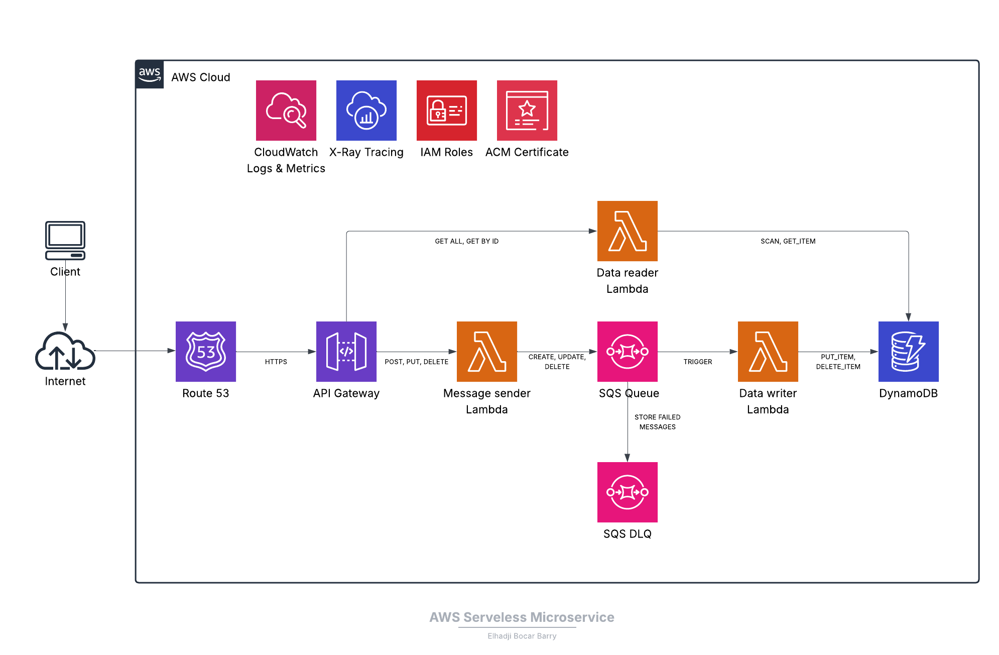

# AWS Serverless Microservice with API Gateway, Lambda, SQS, and DynamoDB

This project is a fully serverless microservice designed to manage product purchases in a scalable, reliable, and cost-effective way. Built using AWS SAM (Serverless Application Model), it demonstrates modern cloud-native architecture patterns by leveraging managed AWS services such as Lambda, API Gateway, DynamoDB, SQS.

The microservice provides a RESTful API for creating, retrieving, updating, and deleting product purchase records. It uses SQS for asynchronous processing, ensuring high availability and decoupling between the API layer and data processing logic. All purchase data is securely stored in DynamoDB, and the system includes a Dead Letter Queue (DLQ) for robust error handling and message durability.

Custom domain support is provided via Route53 and AWS Certificate Manager (ACM), enabling secure HTTPS endpoints for your API. CloudWatch is integrated for centralized logging, making it easy to monitor, troubleshoot, and audit the system.

In this project, we will learn how to build a serverless microservice using AWS SAM template, deploy it using the AWS SAM CLI, and test the API endpoints with curl commands.

## 1. Features and Architecture
This project includes the following features:

- **API Gateway RESTful API**: Exposes endpoints for managing product purchases (create, retrieve, update, delete).
- **Event-Driven Architecture**: Utilizes SQS for decoupling API requests from data processing allowing for the different components to scale independently.
- **Dead Letter Queue (DLQ)**: Handles failed messages for reliable error recovery.
- **Serverless Architecture**: Built entirely on AWS managed services, eliminating the need for server management.
- **Cost-Effective**: Fully serverless architecture with pay-as-you-go pricing.
- **Scalable**: Automatically scales with demand, handling varying loads without manual intervention.
- **DynamoDB Storage**: Utilizes a fully managed NoSQL database for fast and reliable data storage
- **Custom Domain Support**: Configures Route53 with a custom user-friendly domain name for the API.
- **HTTPS Support**: Secures API endpoints with SSL/TLS using AWS Certificate Manager (ACM).
- **Access and Execution Logging**: API Gateway access and execution logs are sent to CloudWatch for monitoring and auditing.
- **Monitoring and Tracing**: AWS X-Ray integration for tracing requests through the system.
- **IAM Roles**: Fine-grained permissions for Lambda functions to interact with AWS services securely.
- **Security at rest**: Server-side encryption for DynamoDB and SQS to protect sensitive data.
- **Infrastructure as Code**: Uses AWS SAM for defining and deploying the serverless architecture, making it easy to version control and replicate the environment.

Here is the architecture diagram of the microservice:



## 2. SAM Template to build the infrastructure
This project uses an AWS SAM (Serverless Application Model) template to define and deploy the serverless microservice. Below is a detailed breakdown of the template's components:

### 2.1 Parameters
The template includes the following parameters to customize the deployment:

| **Parameter**      | **Type**                          | **Default** | **Allowed Values**         | **Description**                                                                 |
|---------------------|-----------------------------------|-------------|----------------------------|---------------------------------------------------------------------------------|
| `StageName`         | String                           | `dev`       | `dev`, `qa`, `staging`, `prod` | Specifies the stage name of the API (e.g., dev, qa, staging, prod).             |
| `DomainName`        | String                           | N/A         | N/A                        | The custom domain name for the API (e.g., api.example.com).                     |
| `HostedZoneId`      | AWS::Route53::HostedZone::Id     | N/A         | N/A                        | The Route53 Hosted Zone ID where the DNS record for the custom domain will be created. |
| `AccessLogGroup`    | String                           | N/A         | N/A                        | The name of the CloudWatch log group for API Gateway access logs.               |

### 2.2 Resources

The SAM template defines the following resources:

#### **1. API Gateway and Custom Domain**
- **`ServerlessApi`**:  
  An API Gateway REST API to handle product purchase requests.  
  - Tracing enabled for monitoring.
  - Access and execution logs configured to write to CloudWatch.
  - Metrics enabled for monitoring API usage.
  - CORS enabled for cross-origin requests.

- **`ApiCustomDomain`**:  
  A custom domain for the API Gateway, secured with an ACM certificate.  
  - Regional endpoint configuration.
  - TLS 1.2 security policy.

- **`ApiBasePathMapping`**:  
  Maps the custom domain to the REST API, allowing requests to be routed correctly.

- **`ApiDnsRecord`**:  
  A Route53 DNS record that points the custom domain to the API Gateway domain name.

- **`ApiCertificate`**:  
  An ACM certificate for the custom domain, enabling HTTPS support.

#### **2. Lambda Functions**
- **`ProductPurchaseMessageSenderFunction`**:  
  Handles API Gateway POST, PUT, and DELETE requests and sends messages to the SQS queue.

- **`ProductPurchaseDataReaderFunction`**:  
  Handles API Gateway GET requests to retrieve product purchase data from DynamoDB.

- **`ProductPurchaseDataWriterFunction`**:  
  Processes messages from the SQS queue and updates DynamoDB with product purchase data.

#### **3. SQS Queues**
- **`ProductPurchaseQueue`**:  
  The main SQS queue for decoupling API requests from data processing.  
  - Includes a redrive policy to send failed messages to the DLQ.
  - Server-side encryption enabled.

- **`ProductPurchaseDLQ`**:  
  A dead-letter queue for handling failed messages from the main SQS queue.
  - Message retention period: 14 days.
  - Server-side encryption enabled.

#### **4. DynamoDB Table**
- **`ProductPurchaseTable`**:  
  A DynamoDB table to store product purchase data.  
  - Partition Key: `ProductPurchaseId` (String)  
  - Server-side encryption enabled.

#### **5. CloudWatch Logs**
- **`ApiGatewayLogGroup`**:  
  A CloudWatch log group for API Gateway access logs.  
  - Retention period: 7 days.

#### **6. IAM Roles**
- **`ProductPurchaseMessageSenderExecutionRole`**:  
  Grants permissions for the Lambda function to send messages to the SQS queue and write logs to CloudWatch.

- **`ProductPurchaseDataWriterExecutionRole`**:  
  Grants permissions for the Lambda function to process SQS messages, update DynamoDB, and write logs to CloudWatch.

- **`ProductPurchaseDataReaderExecutionRole`**:  
  Grants permissions for the Lambda function to read data from DynamoDB and write logs to CloudWatch.

- **`ApiGatewayCloudWatchRole`**:  
  Grants permissions for API Gateway to write access and execution logs to CloudWatch.

### 2.3 Outputs

The SAM template provides the following outputs after deployment:

| **Output Name**       | **Description**                                      | **Example Value**                                                                 |
|------------------------|------------------------------------------------------|-----------------------------------------------------------------------------------|
| `ProductPurchaseApi`   | The API Gateway endpoint URL for the ProductPurchase API. | `https://<api-id>.execute-api.<region>.amazonaws.com/<StageName>/product-purchase/`   |
| `CustomDomainUrl`      | The custom domain URL for the ProductPurchase API.   | `https://<DomainName>/product-purchase/`                                       |

## 3. Deployment Instructions

Follow these steps to deploy the SAM template and set up the serverless microservice:

### 3.1 Prerequisites

Before deploying, ensure you have the following:
- **AWS CLI** installed and configured with appropriate permissions.
- **AWS SAM CLI** installed ([Installation Guide](https://docs.aws.amazon.com/serverless-application-model/latest/developerguide/install-sam-cli.html)).
- **Python 3** installed for Lambda function dependencies.
- An **AWS account** with the necessary permissions to create resources.
- A **Route53 Hosted Zone** for the custom domain.

### 3.2 Deployment Steps

1. **Go the SAM directory**  
   Execute the following command from the root directory.
   ```bash
   cd 04-medium-projects/04-serverless-microservice/sam
   ```
2. **Build the SAM Application**  
   Use the SAM CLI to build the application:
   ```bash
   sam build
   ```
3. **Deploy the SAM Application**
   
   Use the SAM CLI to deploy the application with default parameters in the `samconfig.toml` file or override the parameters with command line or with guided prompts with the `--guided` option:
   ```bash
   sam deploy --parameter-overrides "DomainName=api.example.com HostedZoneId=ZXXXXXXXXXXXXX AccessLogGroup=api-gw-access-log StageName=dev"
   ```
4. **Verify the Deployment**
   
   After deployment, you will see the API Gateway endpoint URL and custom domain URL in the output. You can use these URLs to test the API.

## 4. Testing the API
You can test the API using tools like Postman or curl. We will use curl commands for testing the API endpoints. Replace the domain name with your custom domain URL in the output after deployment.

### 4.1 Create a Product Purchase
We will create a new product purchase record using the POST method with the message bodies in the `events` folder. Execute the following command a couple of times by changing the message body:
```bash
curl -X POST https://api.example.com/product-purchase/ \
-H "Content-Type: application/json" \
-d @../events/message-body-1.json
```
The response should look like the following. You can then check the DynamoDB table to see that the records have been created successfully:
```json
{"message": "Message sent successfully", "messageId": "de9c7ea9-51ca-4d22-ac64-e21b6bb7de45"}
```

### 4.2 Get All Product Purchases
To retrieve all product purchases, use the following GET request:
```bash
curl -X GET https://api.example.com/product-purchase
```
The response should look like the following:
```json
[
  {
    "ProductPurchaseId": "865f8acb-079d-4ffd-8d70-97b01040c4ea",
    "ProductId": "c96b49bb-c378-4a15-b2e3-842a9850b23d",
    "ProductName": "iPhone",
    "Category": "Phones",
    "PricePerUnit": "1032",
    "Quantity": "3",
    "TotalPrice": "3096",
    "CustomerId": "b20f30ta-29d3-10f3-wov0-10c39a30sgfs",
    "CustomerName": "Sarah Harris",
    "TimeOfPurchase": "2021-02-28T10:02:12.034Z",
    "action": "create"
  },
  {
    "ProductPurchaseId": "97a97a2d-bdb5-4ab6-8d71-c5deb809a6ee",
    "ProductId": "d4b5d11b-119b-4a02-a5d0-71fd192dba99",
    "ProductName": "Jacket",
    "ProductDescription": "A stylish jacket for all seasons.",
    "Category": "Clothing",
    "PricePerUnit": "189",
    "Quantity": "1",
    "TotalPrice": "189",
    "CustomerId": "wf9s200a-72f4-42ge-pw0c-10f3jf03l59f",
    "CustomerName": "Paul Jones",
    "TimeOfPurchase": "2021-02-15T19:13:32.314Z",
    "action": "create"
  },
  {
    "ProductPurchaseId": "ce13a6eb-b47a-4e58-aba4-ac81cb6d798c",
    "ProductId": "c96b49bb-c378-4a15-b2e3-842a9850b23d",
    "ProductName": "Belt",
    "ProductDescription": "A durable leather belt.",
    "Category": "Accessories",
    "PricePerUnit": "10",
    "Quantity": "1",
    "TotalPrice": "10",
    "CustomerId": "be44af0a-74f9-438e-a3ac-e3e21d84259f",
    "CustomerName": "John Doe",
    "TimeOfPurchase": "2021-01-31T16:23:42.389Z",
    "action": "create"
  }
]
```
### 4.3 Get a Product Purchase by Id
To retrieve a Product Purchase, use the following GET request with one of the `ProductPurchaseId` from the previous response:
```bash
curl -X GET https://api.example.com/product-purchase/97a97a2d-bdb5-4ab6-8d71-c5deb809a6ee
```
The response should look like the following:
```json
{
  "ProductPurchaseId": "97a97a2d-bdb5-4ab6-8d71-c5deb809a6ee",
  "ProductId": "d4b5d11b-119b-4a02-a5d0-71fd192dba99",
  "ProductName": "Jacket",
  "ProductDescription": "A stylish jacket for all seasons.",
  "Category": "Clothing",
  "PricePerUnit": "189",
  "Quantity": "1",
  "TotalPrice": "189",
  "TimeOfPurchase": "2021-02-15T19:13:32.314Z",
  "CustomerId": "wf9s200a-72f4-42ge-pw0c-10f3jf03l59f",
  "CustomerName": "Paul Jones",
  "action": "create"
}
```
### 4.4 Update a Product Purchase
To update a product purchase, use the following PUT request with one of the `ProductPurchaseId` from the previous response and change the message body:
```bash
curl -X PUT https://api.example.com/product-purchase/97a97a2d-bdb5-4ab6-8d71-c5deb809a6ee \
-H "Content-Type: application/json" \
-d @../events/message-body-2.json
```
The response should look like the following. You can then run the GET request or check the DynamoDB table to see that the records have been updated successfully:
```json
{"message": "Message sent successfully", "messageId": "e9c894fc-d22a-45f9-b839-fe0cc1b05c29"}
```
### 4.5 Delete a Product Purchase
To delete a product purchase, use the following DELETE request with one of the `ProductPurchaseId` from the previous response:
```bash
curl -X DELETE https://api.example.com/product-purchase/97a97a2d-bdb5-4ab6-8d71-c5deb809a6ee
```
The response should look like the following. You can then run the GET request or check the DynamoDB table to see that the record has been deleted successfully:
```json
{"message": "Message sent successfully", "messageId": "d7e59c33-5afa-4d07-9246-45eb5ce79015"}
```

## 5. Cleanup
To clean up the resources created during the deployment, run the following command:
```bash
sam delete
```
This will remove all the resources created by the SAM template, including the API Gateway, Lambda functions, SQS queues, DynamoDB table, CloudWatch logs...

## 6. Futher steps
This project can be extended in several ways to enhance its functionality and make it production-ready. Here are some suggestions for future improvements:
- **Dead Letter Queue (DLQ) Monitoring**: Implement monitoring and alerting for the DLQ to handle failed messages effectively.
- **Add Authentication and Authorization**: Implement AWS Cognito or API keys to secure the API endpoints and control access.
- **Implement CI/CD Pipeline**: Use AWS CodePipeline and CodeBuild to automate the deployment process
- **Web/Mobile client application with WebSocket API**: Create a web/mobile client application that will use the REST API and implement API Gateway WebSocket API for real-time notifications
. You can leverage DynamoDB Streams to trigger Lambda functions for real-time updates when data changes in the DynamoDB table.

